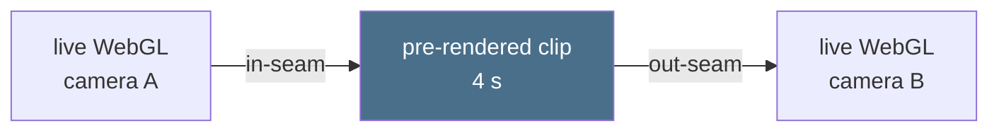

# 002 — Living map, session log

## Session A — LiDAR terrain in the browser

Date: 8 Sep 2026
Intent in one sentence: Prove real Cheltenham terrain can live in the browser and be recognised.
Tool/build/model: EA WCS 2.0.1 service, Python 3.11 (numpy/tifffile/Pillow), Three.js 0.169.0 (vendored), headless Chromium for capture.
Input files / source rights: EA LIDAR Composite DTM 1m via WCS (`spatialdata/lidar-composite-digital-terrain-model-dtm-1m/wcs`, coverage `..._Lidar_Composite_Elevation_DTM_1m`), Open Government Licence v3, attributed on the page.
Time / credits used: one cloud session; no paid generation.

### One variable to explore

Whether a single WCS `GetCoverage` request (12×12 km box, E 388000–400000 / N 216000–228000, `scaleFactor≈0.17` → 2048², ~16 MB GeoTIFF) beats the interactive tile portal for a repeatable pipeline.

### What I predicted

Tile downloads and GDAL wrangling; possibly no programmatic route at all.

### What happened

The dataset exposes a proper WCS with GeoTIFF output and server-side scaling — one URL replaces the whole portal flow. Elevation range came back 8.25–330.04 m; 330 m is Cleeve Hill's actual summit, which validated the data before a single pixel rendered. Converted to a 16-bit PNG (archival, 2048²) plus a uint16 binary (1024², 2 MB) the page reads directly, dodging the browser's 8-bit PNG decode. CPU vertex displacement (513² grid) with height+slope vertex colours rendered at full speed; ×1.8 vertical exaggeration keeps the scarp legible from map altitude. Drainage lines and field boundaries are visible in the vale — 1 m LiDAR carries texture even downsampled to ~12 m.

### Saved outputs

Source file: `experiments/002-living-map/terrain/` (page + data + vendored three.js). Rerun the fetch with `scripts/lidar_to_heightmap.py` and the WCS URL in this log.
Preview: `exports/002-living-map-terrain-v001.png`
Selected variant: south-west opening camera, town centred, escarpment behind.

### Review (Session A)

What works: the terrain is unmistakably Cheltenham; markers for GCHQ/Golden Valley, town centre and Cleeve Hill confirm georeferencing (EPSG:27700 → local XZ) is correct.
What I can now change without AI: palette ramp stops, vertical exaggeration, camera limits, marker set, box extent.
One failure worth keeping: first WCS guess used a wrong service path (`environment.data.gov.uk/image/...` — doesn't exist); the real pattern is `environment.data.gov.uk/spatialdata/<dataset-slug>/wcs`, discovered by scraping the dataset page for service links.
Next 20-minute experiment: Session B — generate the first descent clip candidates between an aerial-style frame and a ground-level photo (needs a Gemini or fal.ai key, and owned imagery of a Cheltenham spot).

## Session A+ — Golden Valley vertical slice

Date: 8 Sep 2026
Intent in one sentence: Prove the map ties to the real place — full 1 m resolution, real buildings at measured heights, true scale.
Tool/build/model: EA WCS (DTM + last-return DSM at native 1 m), OSM map API for footprints, pyproj for EPSG:27700↔WGS84, Three.js ExtrudeGeometry + merged buffers.
Input files / source rights: EA LiDAR composites (OGL v3); building footprints © OpenStreetMap contributors (ODbL). Both attributed on the page.

### What happened

`scripts/golden_valley_slice.py` builds the whole dataset: 2×2 km box (E 390400–392400, N 221400–223400) fetched at native 1 m from both the DTM and the last-return DSM; **DSM − DTM = measured height of everything standing on the ground**. 4,042 OSM footprints rasterised against that difference grid give 4,033 buildings, each extruded to its median measured height (median 5.7 m — two-storey Benhall, correct; the page renders them as an archviz white model over the terrain, no vertical exaggeration).

Three catches worth recording: (1) Overpass API is unreachable through this environment's proxy — the plain OSM `map` endpoint works for small boxes and returns everything; (2) my remembered GCHQ coordinate was ~1 km off and the first box clipped the doughnut — always convert a checked lat/lon through pyproj rather than trusting recall; (3) the doughnut is an OSM *relation* (outer ring + courtyard hole), so way-only parsing missed the single most recognisable building — the parser now handles building relations with holes, and the courtyard renders.

Validation: LiDAR-measured doughnut height 14.8 m over a 52.7 m base; the surrounding crescents match the real street pattern; B&Q, the BMW dealer and Nuffield Hospital all appear where they are in life.

### Saved outputs

Source: `experiments/002-living-map/golden-valley/` (page + data), `scripts/golden_valley_slice.py` (rerun to rebuild).
Preview: `exports/002-living-map-goldenvalley-v001.png`
Camera/capture support: `?cam=x,y,z&look=x,z&clean=1` URL parameters frame clean stills — this is how descent frame A endpoints are rendered.

## Session B — descent pipeline (prepared, awaiting key)

`scripts/generate_descent.py` is the one-command pipeline: frame A + frame B → N candidate clips via Veo 3.1 frames-to-video (Gemini API), with a JSON run log for prompt/timing/cost discipline. Frame A for the first descent is rendered and saved (`descent/frames/gv-doughnut-aerial-frameA.png`, clean capture over the doughnut).

Blocked on two inputs: a `GEMINI_API_KEY` in the environment, and a frame B (ground-level photo or render of the destination). Next 20-minute experiment once the key lands: three candidates between the saved frame A and a frame B, then the Session C seam test.

## Session B key test — key did not reach the container

Date: 8 Sep 2026
Intent in one sentence: Verify the newly added GEMINI_API_KEY works for Veo generation with one cheap candidate.
Tool/build/model: attempted `veo-3.1-fast-generate-preview` via `scripts/generate_descent.py` (image-to-video from frame A alone).

**Key worked: no.** `GEMINI_API_KEY` was not present in the freshly provisioned container's environment, so the variable set in the claude.ai environment settings did not propagate. The free validation (`GET /v1beta/models`) confirmed it independently: with no key header Google returned 403 "unregistered caller" (the proxy injected nothing), and a placeholder header was forwarded verbatim and rejected with 400 API_KEY_INVALID. The generation script exited before any billable call ("GEMINI_API_KEY is not set"), so generation wall time was 0 s and cost was zero. Evidence in `descent/keytest/run-log.json`.

Fix to try: re-save the key in the environment settings and start a fresh session — env vars are read at container start, and this container (provisioned 8 Sep 13:14 UTC) never received it.

## Session B key test — retry after credential fix

Date: 8 Sep 2026
Intent in one sentence: Re-verify Veo access now that the Gemini credential is injected by the network proxy as an `x-goog-api-key` header rather than exposed as an env var.

**Key worked: no.** The free validation call (`GET /v1beta/models`, no key header or query param added by this test, letting the proxy attach the credential) returned HTTP 401 UNAUTHENTICATED / `ACCESS_TOKEN_TYPE_UNSUPPORTED` — not the 403 "unregistered caller" seen last time, but still not a successful auth. Per the test instructions, generation was not attempted since the free step failed; wall time was 0 s and no billable call was made. Evidence in `descent/keytest/run-log.json`.

One-line note: the credential header mechanism was reconfigured between attempts, from `Authorization: Bearer <key>` to `x-goog-api-key` with no prefix (the format the Generative Language API expects) — this retest confirms the header format change alone hasn't yet produced a working call.

Correction (checked directly, 8 Sep ~15:05 UTC): there is no credential
injection to reconfigure. The agent proxy documents CA trust and egress
policy only — it attaches no Gemini credential, and `/__agentproxy/status`
lists no such accommodation. `GEMINI_API_KEY`, `GOOGLE_API_KEY`,
`GOOGLE_GENAI_API_KEY` and `FAL_KEY` are all unset in this container too, and
an uncredentialled `GET /v1beta/models` returns Google's ordinary 401
`ACCESS_TOKEN_TYPE_UNSUPPORTED` — the 403-then-401 change between attempts is
Google's own response to no credentials, not evidence of a header being
attached. Both key tests are therefore the same result: **no key has reached
any container**, and the only fix is a `GEMINI_API_KEY` saved in the "Play
area" environment settings, picked up by a session started afterwards.
## Session C — the descent seam, measured

Date: 8 Sep 2026
Intent in one sentence: Find out whether a viewer can see the cut between the live map and a pre-rendered descent — and if so, what actually causes it.
Tool/build/model: Three.js scene shared with the map page, headless Chromium for rendering, ffmpeg (VP9 + H.264) for encoding and decoding. No paid generation.
Input files / source rights: as Session A+ (EA LiDAR OGL v3, OSM footprints ODbL).
Time / credits used: one cloud session; £0.

### The thing being tested

A descent is two cuts, not one:



Either cut can betray the trick. So rather than argue about it, I rendered a
**control clip** — the descent path drawn from the very same scene the map
runs — and measured both seams. A control has perfect seams by construction,
so every percentage point that shows up is the *pipeline's* error, not the
world's, and a generated clip inherits all of it as a floor.

### One variable to explore

How far can the clip's last frame drift from where the live map resumes
before the hand-back is visible? `?errors=` renders the destination as the
map would draw it at 0, 5, 10, 20, 40 and 60 m of landing error, and each is
compared against the clip's decoded final frame.

### What I predicted

That codec quality would be the problem, and we would need an expensive encode.

### What happened

The opposite, decisively. Mean absolute pixel difference, delivery encode
(VP9, 1.84 MB for 4 s at 1280x720):

| seam | mean | pixels a viewer could see differ |
|---|---|---|
| in-seam (clip frame 0 vs live A) | 0.48 % | 0.95 % |
| out-seam, 0 m landing error | 0.46 % | 1.8 % |
| out-seam, 5 m | 2.50 % | 12.0 % |
| out-seam, 10 m | 3.56 % | 17.6 % |
| out-seam, 60 m | 7.05 % | 31.1 % |

Re-encoding all but losslessly (18.8 MB, ten times the size) moves the 0 m
case from 0.46 % to 0.38 %. **Codec is not the limiting factor — landing
accuracy is.** Five metres of drift is a five-fold jump in error and a
twelve-fold jump in visibly different pixels.

The geometry says why. At the landing the camera sits 300 m from the
doughnut with a 48° field of view across 1280 px, so one pixel is 0.21 m:

```
metres per pixel = 2 x 300 m x tan(24°) / 1280 px = 0.209
5 m of drift  ->  24 px of jump   (obvious)
0.5 m         ->  2.4 px          (a cross-fade will bury it)
```

### The consequence for the project

The last frame of a generated descent cannot be left to the generator's
judgement — it has to be *given* to it. Veo's frames-to-video mode takes a
last-frame anchor, and that anchor must be rendered from our own scene at
exactly camera B, which `scripts/capture_descent_path.py` now does as a
by-product. Landing on a photograph of the real place is still possible, but
it is a separate, deliberate cut, not this hand-back — or the photograph has
to be registered into the scene first.

### Saved outputs

Source: `experiments/002-living-map/descent/` — `descent-path.json` (the path,
shared by every renderer of it), `path.js`, `seam-test/` (the page),
`clips/descent-control.webm`, `seam-report.json` (the numbers above).
Rebuild everything with `python3 scripts/capture_descent_path.py`.
Also saved: `descent/frames/gv-doughnut-landing-frameB.png` — the destination
rendered from the live scene at camera B. That is the last-frame anchor
Session B needs, so the descent no longer waits on a photograph of the place.
Preview: `exports/002-living-map-descent-sheet-v001.png`

### Review (Session C)

What works: the hand-off itself. Serve the folder, open
`descent/seam-test/index.html`, press **Run descent**, and the map descends
and hands back with nothing to see — then drag *landing error* to 5 m and
press **Flip** to watch it fall apart.
What I can now change without AI: path endpoints, easing, clip length, fade
duration, encode settings — all in one JSON file and one script.
One failure worth keeping: the first version of this test measured the seams
inside the browser and reported a 6.8 % out-seam. It was measuring nothing of
the kind — `seeked` fires when the decoder has moved, not when a frame has
been *painted*, so headless Chromium kept handing `drawImage` the previous
frame and the test compared the clip's opening frame against the destination.
Two lessons: a measurement that surprises you deserves a second, independent
route before it becomes a finding; and the render is bit-for-bit reproducible
(the refactor onto a shared `scene.js` changed exactly zero pixels), which is
what makes offline comparison trustworthy in the first place.
Next 20-minute experiment: Session B proper — same path, but the middle four
seconds generated by Veo from our own frame A and frame B, then re-run this
measurement and compare against the control's floor.

## Session B — the first generated descent (8 Sep 2026, run locally)

Ran on Dex's Windows machine rather than the cloud container, because the
container has never been able to see a Gemini credential. Locally the split is
the same as it was there: `FAL_KEY` present, `GEMINI_API_KEY` absent — the
BrandFlow desktop app keeps both in the Windows Credential Manager
(`service "BrandFlow Studio"`, accounts `gemini-api-key` / `fal-api-key`),
not in any `.env`, and reading it out of the vault is blocked in this harness.
So **fal only this session; Veo still unrun.**

Protocol held: dry-run first (free, confirmed the request shape and that the
key was seen), then one candidate, then measure before buying more. One paid
call, no retries.

| | in-seam | out-seam |
|---|---|---|
| control floor (our own render) | 0.478 % | 0.464 % |
| **Kling 1.6 Pro, 1 candidate** | **2.793 %** | **1.427 %** |
| visible pixels | 17.25 % | 6.02 % |

- model: `fal-ai/kling-video/v1.6/pro/image-to-video`, both anchors attached
  (`image_url` + `tail_image_url`), `--style clay`
- wall time **4m 00s** for one 5 s clip; cost **~£0.37 / $0.475 estimated**
  (5 s at Kling 1.6 Pro's per-second rate — the run log does not record the
  actual charge, which is a gap worth closing in `generate_descent.py`)
- 1920×1080 30 fps, 6.2 MB, rounded up from the requested 4.0 s to Kling's 5 s
  minimum

### The finding, which inverts Session C's assumption

Session C concluded landing accuracy is everything and the departure is free,
because at the destination one pixel is 0.21 m. **The generated clip does the
opposite: the in-seam is twice as bad as the out-seam.**

The reason is detail density, not geometry. Frame A is a wide aerial holding
several thousand tiny extruded buildings; the model cannot reproduce that
high-frequency field pixel-for-pixel, so it redraws it slightly. Frame B is a
low landing view of a handful of large masses, which it matches far more
closely. Two checks ruled out the boring explanations:

- **not framing** — anchors and clip are both 16:9; a zoom sweep from 1.00 to
  1.08 has its minimum at exactly 1.00, so there is no scale or crop mismatch
- **not tone** — fitting a per-channel gain and offset *worsens* the in-seam
  (2.79 % → 2.91 %) and only recovers 28 % of the out-seam error, so this is
  structural, not a grade

So the seam budget should be spent the other way round from what we planned:
cross-fade the departure, cut the landing. The departure is also where the
camera is moving fastest, which is exactly where a fade is cheapest to hide.

### What actually worked

The style held. `--style clay` was the thing I most expected to fail and it
did not drift photoreal at any point in the five seconds — matte white masses,
pale green terrain, no foliage or signage invented. Geometry stayed rigid:
GCHQ's doughnut stays a doughnut with its courtyard intact all the way down,
and no new structures appear. As a piece of camera work it is a genuinely
convincing continuous descent. The failure is entirely in the pixel-exact
hand-back at the top, not in the shot.

### Saved outputs

`descent/fal/candidate-0.mp4`, `descent/fal/run-log.json`,
`descent/fal/seam-report.json`.
Preview: `exports/002-living-map-descent-fal-sheet-v001.png` — anchor A, four
frames through the clip, anchor B, side by side.

### Review (Session B)

Worst thing about it: 17 % of the departure frame is visibly different, which
would read as a flicker on the cut. Best thing: it cost one call to learn that
the expensive end of the descent is the cheap end to fix.
Next 20-minute experiment: re-generate with frame A taken 300 m lower, where
the building field is sparser, and see whether the in-seam falls towards the
out-seam's 1.4 %. If it does, the rule is "hand over below the detail
threshold" and the whole descent path gets re-cut around it. Then the same
two frames through Veo, once a key is available, as the provider comparison
this session could not run.
## Session D — the hotspot descent player

Date: 8 Sep 2026
Intent in one sentence: Turn Session C's proven hand-off into the thing it exists for — click a place, descend into it, come back.
Tool/build/model: Three.js scene shared with the seam test, Playwright for an end-to-end interaction test, no paid generation.

### One variable to explore

Whether the descent can be made a property of a *place* rather than a
hard-coded path — and specifically whether the map can be complete before any
generated clip exists.

### What happened

`descent/hotspots.json` now holds three places, each with a descent path in
the shape `descent-path.json` already used, and an optional `clip`. The
doughnut carries the Session C control clip; the other two carry `null` and
**descend live along the identical path**. That fallback is the design, not a
stopgap: the path is the source of truth and the clip is an enhancement, so a
clip can be generated, swapped, regenerated or dropped without touching the
experience around it — and the map is finished today.

`descent/player.js` is the mechanism, reusable and place-agnostic: fly from
wherever the viewer is to the top of the path, hand over to the clip (or fly
it), hand back, and offer the way home.

Three things that only showed up by testing the real thing:

1. **`maxPolarAngle` quietly stole the landing.** The map stops you tipping
   below the horizon; an arrival is a low, near-level shot by design. The
   path put the camera exactly on the clip's last frame, then OrbitControls'
   first `update()` enforced its limit and lifted it 26 m — off the frame the
   clip had just handed over. The player now opens the pitch limit to
   whatever the arrival needs and restores it on the way out.
2. **`[hidden]` does nothing against an author `display` rule.** `.descent-clip`
   sets `display: block` and `.hotspot` sets `display: flex`, both of which
   outrank the user agent's `[hidden] { display: none }`. So the clip stayed
   on screen after handing back — showing its own first frame, which is
   camera A, over a live canvas that had correctly moved to camera B. It read
   exactly like a broken descent while the code was doing its job perfectly.
3. **The test agreed with the bug.** It asserted `!button.hidden`, which was
   true, while the screenshot showed all three pills still drawn. Assertions
   now read `getComputedStyle(...).display`, because what matters is what is
   on the screen, not what a property says.

There is also a geometry detail worth keeping: a clip has one aspect ratio
for ever and a window has whatever the viewer gives it. The overlay uses
`object-fit: cover`, so `matchFovToClip()` narrows the live camera's vertical
field of view by exactly the amount `cover` crops. Without it the two images
are at different scales and the seam shows however perfectly the clip lands.

### Saved outputs

Source: `experiments/002-living-map/descent/{hotspots.json,player.js,path.js}`,
`experiments/002-living-map/golden-valley/`. Test: `python3 scripts/test_hotspot_flow.py --shots DIR`
(8 checks, including that the clip's `currentTime` actually advanced — headless
virtual time fast-forwards timers but not media, so only a real-time run can
tell the clip route from its fallback).
Preview: `exports/002-living-map-hotspots-v001.png`

### Review (Session D)

What works: the whole loop — click, descend, arrive, read, return — with the
control clip on one place and live flight on the other two, and no visible
difference in how they behave.
What I can now change without AI: places, blurbs, paths, fade length, and
which places have clips, all from one JSON file.
One failure worth keeping: I diagnosed the stuck-at-camera-A symptom as the
`[hidden]` bug, fixed that, and the symptom stayed — because there were two
independent causes and I had stopped at the first. The pitch clamp was the
other. Fixing what you find is not the same as fixing what you are looking at.
Amended the same day, once Session B's numbers landed: the player's fades are
now asymmetric — 320 ms into the clip, 80 ms out of it. Session C's control
said both seams were equal, so a symmetric fade looked right; Session B's
generated clip put the departure at twice the landing, so the fade is spent
where the error actually is. Both live in `hotspots.json` as data, per path.
This is the point of keeping the path and the clip separate: a measurement
changed the experience without anything being rebuilt.

Next 20-minute experiment: Session B's proposal — re-cut the path so the
hand-over happens *below* the detail threshold (frame A around 150 m rather
than 300 m, where the building field is sparser) and see whether the in-seam
falls towards the out-seam's 1.4 %. The anchors for it are a capture run
away.

## Session E — land cover, roads and trees

Date: 9 Sep 2026
Intent in one sentence: Stop the ground reading as a lawn — Phase 2 of the look plan and the tree half of Phase 3, in one pass, from OSM we already hold.
Tool/build/model: Python + PIL rasterisation, Three.js `InstancedMesh`, headless Chromium for stills, no paid generation.

### One variable to explore

Whether **surface** is really what was missing. Every session so far had gone
into structure, and Phase 1 suggested the answer without proving it: light
alone turned the massing model into an architectural render, but it was still
an architectural render of a lawn.

### What happened

`scripts/golden_valley_landcover.py` reads the OSM extract already cached
from the buildings run — no new fetch — and finds 327 area polygons, 1,484
lines and 540 individually surveyed trees inside the same 2 km box. It writes
three things:

| file | size | what it is |
|---|---|---|
| `gv-landcover.png` | 605 KB | the ground, 1 m per texel, roads drawn in |
| `gv-trees.bin` | 72 KB | 9,181 trees, 8 bytes each |
| `gv-landclass.png` | 169 KB | the same raster as class indices, for Phase 4 |

Two decisions carried the result.

**Roads are texels, not geometry.** A service road is 4 m wide and the
terrain mesh's triangles are 2 m, so as geometry the road network would
z-fight and crawl at every altitude. Drawn into the ground image at 2x and
box-downsampled, it is exact, anti-aliased, and the entire network — 1,484
ways — costs one texture fetch. It is also why anisotropy is not optional
here: at 1 m/texel over 2 km, the far half of an aerial view is deep in the
mip chain, which is exactly where an aerial spends most of its pixels.

**Trees carry no Y.** Each 8-byte record holds x, z, height, rotation, kind
and canopy spread, and the map computes the ground height from the same field
the terrain is built from. A tree therefore cannot float or sink if either
ever changes — the one class of bug that would otherwise be invisible until a
descent lands next to it.

The vale now measures 31.7 % residential, 22.9 % farmland, 10.5 % amenity
grass, 9.4 % carriageway, 7.1 % meadow, 4.5 % woodland, 3.0 % park, 0.66 %
water. None of that was art-directed; it is what is there.

### Two things that cost time, both worth keeping

1. **PIL reads an integer colour lowest-byte-first.** `fill=0x7d9460` paints
   `#60947d`. The whole first raster came out in BGR — a plausible-looking
   mint-green Cheltenham that only gave itself away when I sampled a pixel
   rather than trusting the render. Colours are tuples now.
2. **`mergeGeometries` returns `null` for a mix of indexed and non-indexed
   inputs.** It does not throw. The trunk is an indexed cylinder and the
   canopy a non-indexed icosahedron, so the tree geometry came back null and
   the failure surfaced hundreds of frames later as
   `Cannot read properties of null (reading 'id')` inside three.module.min.js
   — a stack trace pointing at everything except the cause.

### Saved outputs

Source: `scripts/golden_valley_landcover.py`,
`experiments/002-living-map/golden-valley/landcover.js`. See it with
`python3 -m http.server` in `experiments/002-living-map` and open
`lookdev/index.html`; add `?bare` to render the same camera without Phase 2,
which is how the comparison sheet was made.
Preview: `exports/002-living-map-landcover-v001.png` (before/after),
`exports/002-living-map-landcover-aerial-v001.png`,
`exports/002-living-map-trees-v001.png`.

### Review (Session E)

What works: the answer to "I can't see the vision" is now a single image. The
same camera, the same light, the same buildings — the only difference is that
the ground knows what it is, and it stops being a diagram.
What I can now change without AI: every colour in one table at the top of the
script, tree density per land-cover class in another, and a rebuild is five
seconds.
One failure worth keeping: I sanity-checked the first raster by *looking* at
it, decided the mint-green fields were a preview quirk, and moved on. The
check that caught it was reading one pixel value. Looking at output is not
inspecting it.

Next 20-minute experiment: roof pitch from the DSM. We take the median height
inside each footprint and throw the rest away, but the ridge and the eaves
are both sitting in a file already on disk — the difference between the
footprint's median and its 90th percentile is a roof.
