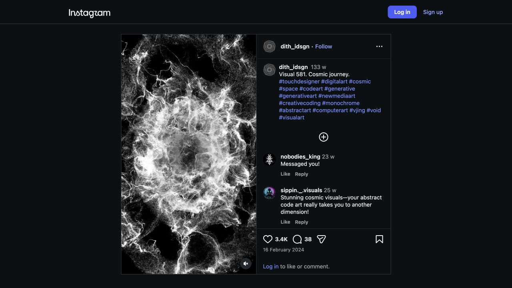
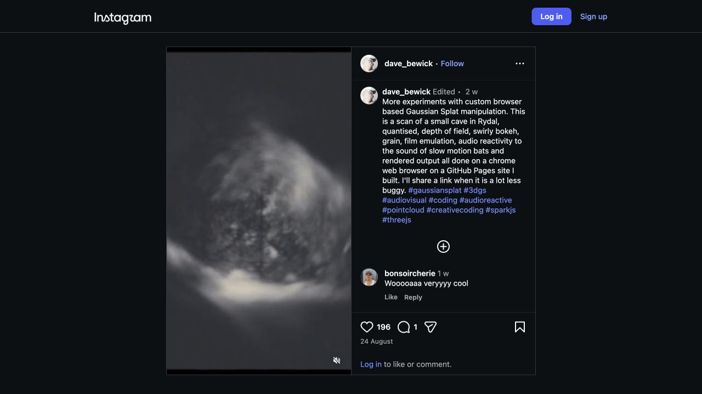
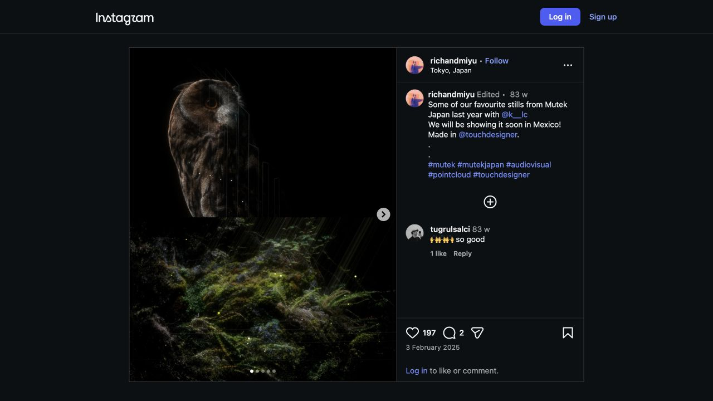
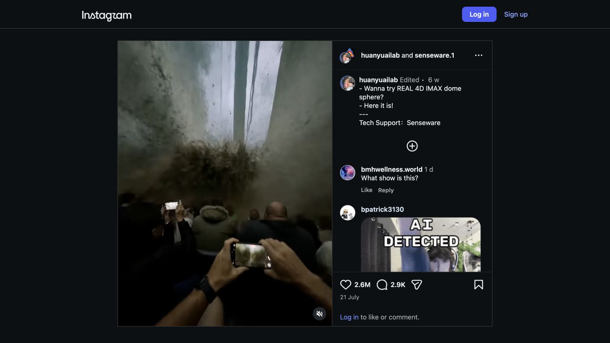
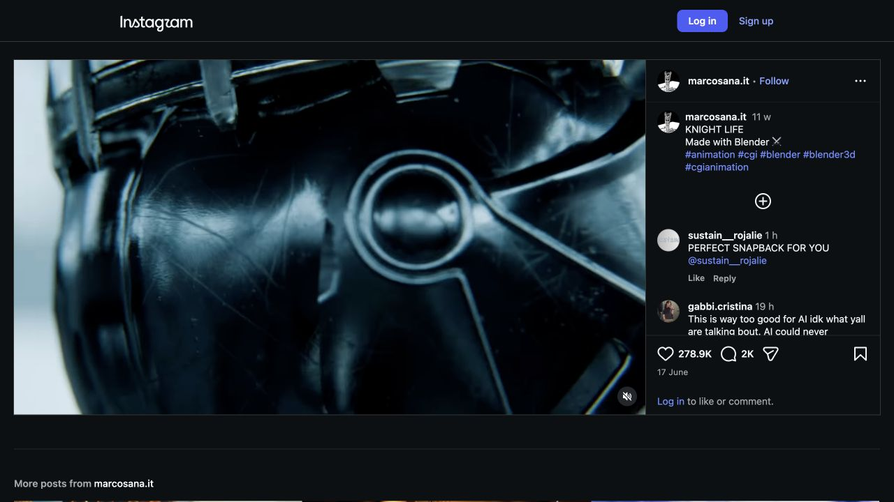
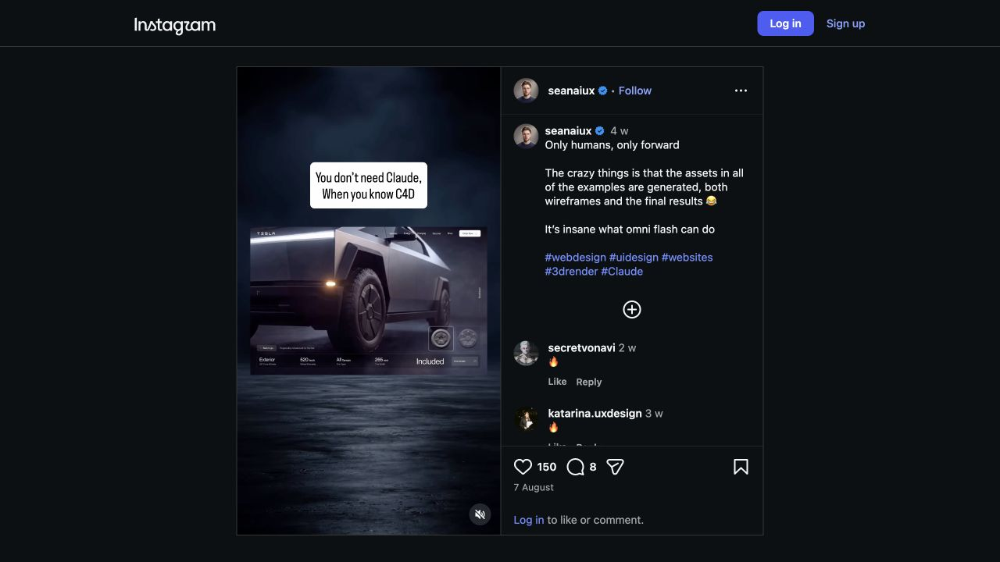
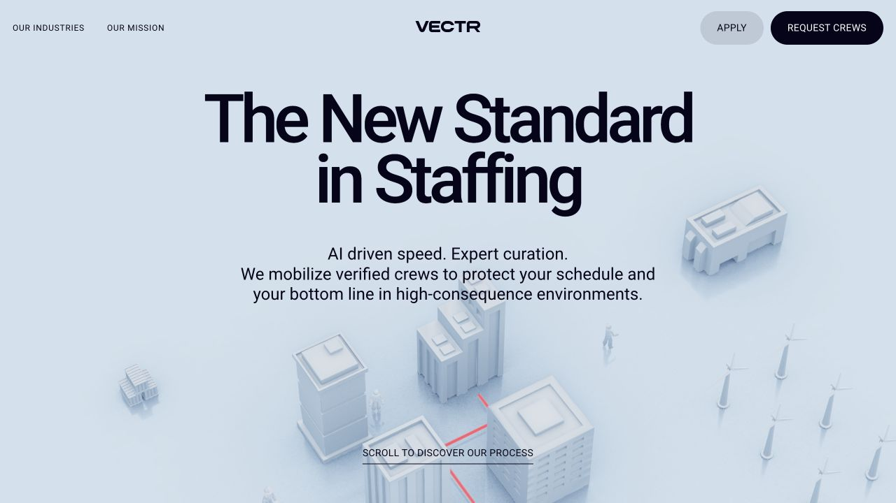
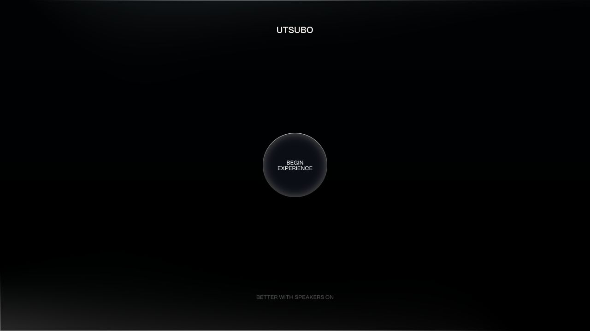

# Inspiration library

Captured 7 September 2026. All seven supplied URLs preserved. Screenshots are study captures with source credit, not reusable production assets. Video captures are representative frames, not archived videos. Interpretations and suggested experiments are ours; tool attribution is based on the creator or vendor where stated.

## I01 · Cosmic journey · Visual 581

**Dimitri Thouzery / dith_idsgn** · Yours · Atmospheres

[Original source](https://www.instagram.com/p/C3aoMWPtiKD/)

Pale filament-like structures against a deep black field. Explore density, negative space and slow spatial drift.

**Evidence:** Caption names the work and tags TouchDesigner; exact node network is not disclosed.

**Try:** Sprint 1 · Make three monochrome noise/displacement studies; keep speed and density independently adjustable.

## I02 · A cave, reimagined as splats

**David Bewick / dave_bewick** · Yours · Worlds

[Original source](https://www.instagram.com/p/DcazaTMJWT6/)

A cave appears tactile and unstable through selective focus and spatial distortion. The strongest bridge between your world-building and web interests.

**Evidence:** Creator describes a Rydal cave scan, browser Gaussian-splat manipulation, depth of field, grain and audio response; tags Spark and Three.js. This is a creator claim, not an inspected implementation.

**Try:** Sprints 4–6 · One splat scene, one camera movement, one controlled distortion.

## I03 · MUTEK Japan · selected stills

**RICH & MIYU** · Yours · Atmospheres

[Original source](https://www.instagram.com/p/DFmw64Pyulk/?img_index=1)

An owl and a mossy landscape broken into luminous, sparse spatial samples. Natural subjects become spectral without losing recognisability.

**Evidence:** Caption explicitly says made in TouchDesigner and tags pointcloud; credits collaboration with @k__lc. First carousel image inspected; later slides remain to study.

**Try:** Sprint 4 · Turn a simple original mesh into a sparse field; compare silhouette readability at three densities.

## I04 · Immersive dome illusion

**HuanYu AI Lab + Senseware** · Yours · Motion

[Original source](https://www.instagram.com/p/DbDPYsTCYwC/)

Apparent audience-scale spectacle and a rushing overhead scene. Study viewpoint, scale and anticipation.

**Evidence:** Post credits Senseware for technical support. Exact production method and whether the depicted event is real are unverified; video generation was the user’s hypothesis.

**Try:** Optional motion study · Make a 5-second original scene with a single dramatic camera move; compare CGI and AI-video routes.

## I05 · KNIGHT LIFE

**Marco Sanalitro / marcosana.it** · Yours · Objects

[Original source](https://www.instagram.com/p/DZsD9CKo69T/)

Armour, cold metal, close camera work and cinematic energy. Use the material and framing as a starting point before attempting a full character.

**Evidence:** Caption explicitly credits Blender. Complete production pipeline is not available.

**Try:** Sprints 2–3 · Design one armoured relic with three separable parts, then light and animate it.

## I06 · Only humans, only forward

**seanaiux** · Yours · Web

[Original source](https://www.instagram.com/p/Dbvgfv4xFM3/)

Cinematic product imagery embedded in web layouts; the user specifically likes exploding components.

**Evidence:** Creator says assets and wireframes in the examples are generated. The reel does not establish whether each shown layout is a functioning 3D website.

**Try:** Sprints 3 + 6 · A 3-part artefact controlled by one explode slider, then connected to scroll.

## I07 · Vectr · world-led landing page

**Vectr / site credit: Utsubo** · Yours · Web

[Original source](https://www.vectrfl.com/)

A pale miniature industrial world, restrained red accent and strong typography. The environment supports the story of the page.

**Evidence:** Homepage visually inspected; footer credits Utsubo. Technical rendering stack not verified.

**Try:** Sprint 6 · Compose three small structures around one camera path and one clear call to action.

## I08 · Utsubo · digital experiences

**Utsubo** · Added · Web

[Original source](https://www.utsubo.com/)

Explore the studio behind Vectr for spatial storytelling and interaction pacing.

**Evidence:** Vectr links to Utsubo. Studio describes web, games and interactive installations. Screenshot captures the entry screen only.

**Try:** Study · Choose one interaction, record trigger → transition → end state, then prototype with primitives.

## I09 · A portfolio you drive through

**Bruno Simon** · Added · Worlds

[Original source](https://bruno-simon.com/)

Use navigation itself as a way to discover work. Study landmarks, orientation and playful feedback.

**Evidence:** Official site identifies Three.js and links source code, including Blender files. Text inspected; visual exploration is queued.

**Try:** Sprint 6 · Place three exhibits with recognisable landmarks and a reset-camera control.

## I10 · Spark · programmable splat examples

**World Labs** · Added · Worlds

[Original source](https://sparkjs.dev/)

A technical inspiration source for making scanned or generated worlds respond like living material.

**Evidence:** Official documentation describes a Three.js Gaussian splat renderer and programmable effects.

**Try:** Sprint 6 · Start with one official example, load one compatible splat and expose one effect parameter.

## I11 · Marble · exportable worlds

**World Labs** · Added · Worlds

[Original source](https://docs.worldlabs.ai/marble/export/specs)

Compare the same place as a panorama, a splat and a mesh. Each representation suggests a different artwork.

**Evidence:** Official export specs list panorama, SPZ/PLY splats and collider/high-quality GLB meshes; account access not checked.

**Try:** Sprint 5 · Compare three viewpoints and one export before committing to a larger world.

## I12 · Machine Dreams / Dataland

**Refik Anadol Studio** · Added · Atmospheres

[Original source](https://refikanadol.com/)

An adjacent research direction for AI art at architectural scale. Investigate how the audience encounters the work.

**Evidence:** Official homepage identifies Machine Dreams: Rainforest and Dataland. Detailed work and methods are queued for closer study.

**Try:** Study · Sketch a single-screen installation with a deliberately chosen viewing distance.

## I13 · TouchDesigner · learning by systems

**Derivative** · Added · Learning

[Original source](https://learn.derivative.ca/all-courses/)

A modular resource to unlock the exact technique needed for the next piece.

**Evidence:** Official curriculum includes TOPs, CHOPs, 3D rendering, scripting and points.

**Try:** Sprints 0–4 · Use 101, 102 and 103 first; open later lessons only when the project needs them.

## I14 · Meshy · object generation

**Meshy** · Added · Learning

[Original source](https://www.meshy.ai/)

A fast source of original object candidates; evaluate all sides before committing to a render.

**Evidence:** Official site describes text/image-to-3D and GLB exports. Access is user-confirmed; no generation performed.

**Try:** Sprint 2 · One original isolated concept → one model → Blender cleanup and lighting.

