# Inspiration library

Captured 7 September 2026. All seven supplied URLs preserved; six more added 22 September 2026 for the dark geometric direction (see dark-geometric/index.html). Screenshots are study captures with source credit, not reusable production assets. Video captures are representative frames, not archived videos. Interpretations and suggested experiments are ours; tool attribution is based on the creator or vendor where stated.

## I01 · Cosmic journey · Visual 581

**Dimitri Thouzery / dith_idsgn** · Yours · Atmospheres

[Original source](https://www.instagram.com/p/C3aoMWPtiKD/)

Pale filament-like structures against a deep black field. Explore density, negative space and slow spatial drift.

**Evidence:** Caption names the work and tags TouchDesigner; exact node network is not disclosed.

**Try:** Sprint 1 · Make three monochrome noise/displacement studies; keep speed and density independently adjustable.

## I02 · A cave, reimagined as splats

**David Bewick / dave_bewick** · Yours · Worlds

[Original source](https://www.instagram.com/p/DcazaTMJWT6/)

A cave appears tactile and unstable through selective focus and spatial distortion. The strongest bridge between your world-building and web interests.

**Evidence:** Creator describes a Rydal cave scan, browser Gaussian-splat manipulation, depth of field, grain and audio response; tags Spark and Three.js. This is a creator claim, not an inspected implementation.

**Try:** Sprints 4–6 · One splat scene, one camera movement, one controlled distortion.

## I03 · MUTEK Japan · selected stills

**RICH & MIYU** · Yours · Atmospheres

[Original source](https://www.instagram.com/p/DFmw64Pyulk/?img_index=1)

An owl and a mossy landscape broken into luminous, sparse spatial samples. Natural subjects become spectral without losing recognisability.

**Evidence:** Caption explicitly says made in TouchDesigner and tags pointcloud; credits collaboration with @k__lc. All five slides inspected 22 Sep 2026: owl, spider (I15), fungi and toad, bird wing, moss, all with thin camera-like frames and loose white points.

**Try:** Sprint 4 · Turn a simple original mesh into a sparse field; compare silhouette readability at three densities.

## I04 · Immersive dome illusion

**HuanYu AI Lab + Senseware** · Yours · Motion

[Original source](https://www.instagram.com/p/DbDPYsTCYwC/)

Apparent audience-scale spectacle and a rushing overhead scene. Study viewpoint, scale and anticipation.

**Evidence:** Post credits Senseware for technical support. Exact production method and whether the depicted event is real are unverified; video generation was the user’s hypothesis.

**Try:** Optional motion study · Make a 5-second original scene with a single dramatic camera move; compare CGI and AI-video routes.

## I05 · KNIGHT LIFE

**Marco Sanalitro / marcosana.it** · Yours · Objects

[Original source](https://www.instagram.com/p/DZsD9CKo69T/)

Armour, cold metal, close camera work and cinematic energy. Use the material and framing as a starting point before attempting a full character.

**Evidence:** Caption explicitly credits Blender. Complete production pipeline is not available.

**Try:** Sprints 2–3 · Design one armoured relic with three separable parts, then light and animate it.

## I06 · Only humans, only forward

**seanaiux** · Yours · Web

[Original source](https://www.instagram.com/p/Dbvgfv4xFM3/)

Cinematic product imagery embedded in web layouts; the user specifically likes exploding components.

**Evidence:** Creator says assets and wireframes in the examples are generated. The reel does not establish whether each shown layout is a functioning 3D website.

**Try:** Sprints 3 + 6 · A 3-part artefact controlled by one explode slider, then connected to scroll.

## I07 · Vectr · world-led landing page

**Vectr / site credit: Utsubo** · Yours · Web

[Original source](https://www.vectrfl.com/)

A pale miniature industrial world, restrained red accent and strong typography. The environment supports the story of the page.

**Evidence:** Homepage visually inspected; footer credits Utsubo. Technical rendering stack not verified.

**Try:** Sprint 6 · Compose three small structures around one camera path and one clear call to action.

## I08 · Utsubo · digital experiences

**Utsubo** · Added · Web

[Original source](https://www.utsubo.com/)

Explore the studio behind Vectr for spatial storytelling and interaction pacing.

**Evidence:** Vectr links to Utsubo. Studio describes web, games and interactive installations. Screenshot captures the entry screen only.

**Try:** Study · Choose one interaction, record trigger → transition → end state, then prototype with primitives.

## I09 · A portfolio you drive through

**Bruno Simon** · Added · Worlds

[Original source](https://bruno-simon.com/)

Use navigation itself as a way to discover work. Study landmarks, orientation and playful feedback.

**Evidence:** Official site identifies Three.js and links source code, including Blender files. Text inspected; visual exploration is queued.

**Try:** Sprint 6 · Place three exhibits with recognisable landmarks and a reset-camera control.

## I10 · Spark · programmable splat examples

**World Labs** · Added · Worlds

[Original source](https://sparkjs.dev/)

A technical inspiration source for making scanned or generated worlds respond like living material.

**Evidence:** Official documentation describes a Three.js Gaussian splat renderer and programmable effects.

**Try:** Sprint 6 · Start with one official example, load one compatible splat and expose one effect parameter.

## I11 · Marble · exportable worlds

**World Labs** · Added · Worlds

[Original source](https://docs.worldlabs.ai/marble/export/specs)

Compare the same place as a panorama, a splat and a mesh. Each representation suggests a different artwork.

**Evidence:** Official export specs list panorama, SPZ/PLY splats and collider/high-quality GLB meshes; account access not checked.

**Try:** Sprint 5 · Compare three viewpoints and one export before committing to a larger world.

## I12 · Machine Dreams / Dataland

**Refik Anadol Studio** · Added · Atmospheres

[Original source](https://refikanadol.com/)

An adjacent research direction for AI art at architectural scale. Investigate how the audience encounters the work.

**Evidence:** Official homepage identifies Machine Dreams: Rainforest and Dataland. Detailed work and methods are queued for closer study.

**Try:** Study · Sketch a single-screen installation with a deliberately chosen viewing distance.

## I13 · TouchDesigner · learning by systems

**Derivative** · Added · Learning

[Original source](https://learn.derivative.ca/all-courses/)

A modular resource to unlock the exact technique needed for the next piece.

**Evidence:** Official curriculum includes TOPs, CHOPs, 3D rendering, scripting and points.

**Try:** Sprints 0–4 · Use 101, 102 and 103 first; open later lessons only when the project needs them.

## I14 · Meshy · object generation

**Meshy** · Added · Learning

[Original source](https://www.meshy.ai/)

A fast source of original object candidates; evaluate all sides before committing to a render.

**Evidence:** Official site describes text/image-to-3D and GLB exports. Access is user-confirmed; no generation performed.

**Try:** Sprint 2 · One original isolated concept → one model → Blender cleanup and lighting.

## I15 · Point-cloud spider (MUTEK Japan, slide 2)

**RICH & MIYU, with @k__lc** · Yours · Atmospheres

[Original source](https://www.instagram.com/p/DFmw64Pyulk/)

A spider built from warm gold and white points on pure black, crossed by thin upright rectangles and a few loose white points. The anchor image for the dark geometric direction.

**Evidence:** Caption says: made in TouchDesigner, tagged #pointcloud. Slide 2 of the same post as I03. Our hypothesis: scanned organisms rendered as points, with capture cameras drawn as thin image planes and tracked feature points left visible.

**Try:** Research plan 002 · Probe A: scan something alive on a phone, render the points on black and draw the cameras where they stood.

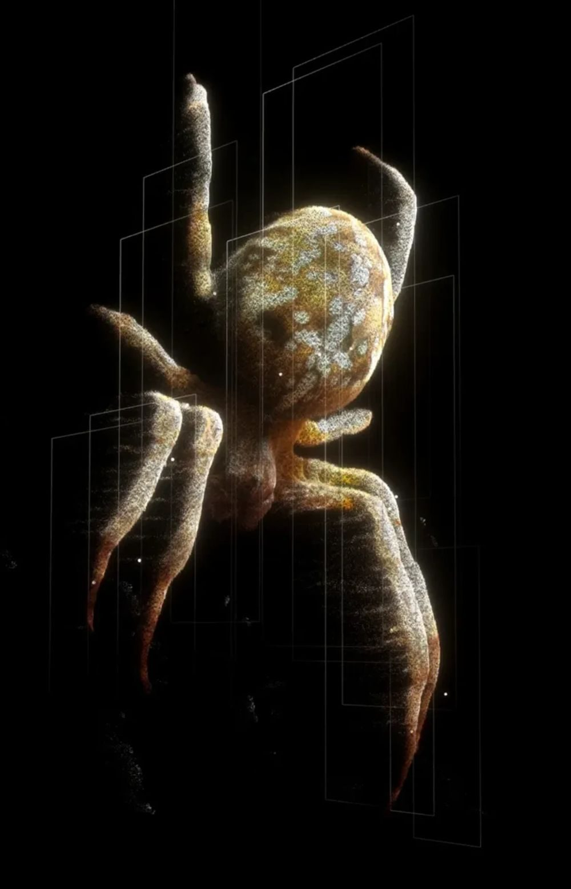

## I16 · Space + time reconstructed in 4D

**Bilawal Sidhu / bilawal.ai** · Yours · Worlds

[Original source](https://www.instagram.com/p/Ddl4fGEzDS0/)

A deer crossing a field at night, every frame left standing where it happened, so the animal becomes a ribbon of itself. A camera frustum marks the present moment.

**Evidence:** Creator says: geolocated 2D video, per-frame 3D Gaussians, each left precisely where and when it happened.

**Try:** Research plan 002 · Study: time trails and 4D capture; which parts could a phone video plus splat tool reproduce?

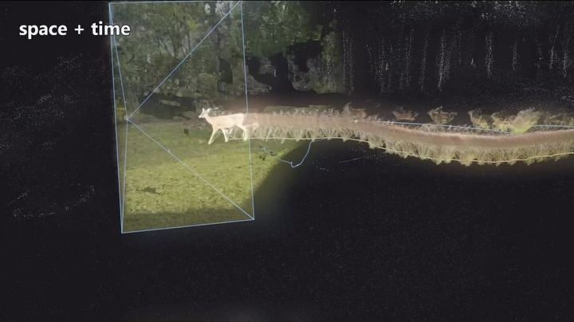

## I17 · Vortex (Rendah Mag feature)

**Ployz (Ploypapus Phosri) / plyzitron, via Rendah Mag** · Yours · Motion

[Original source](https://www.instagram.com/rendahmag/reel/DXUbWnEj9si/)

White strands and particles spiral into a bowl, pulled by two vertical threads, over thin concentric rings. Pure monochrome force and motion.

**Evidence:** The Rendah Mag caption names no tools. The artist (Berlin-based) says TouchDesigner has been their main tool since 2019 and teaches point-cloud work with POPs; the method for this piece is our hypothesis (particle or strand simulation).

**Try:** Research plan 002 · Probe C: attractor particles as additive white trails on black, with three thin rings for scale.

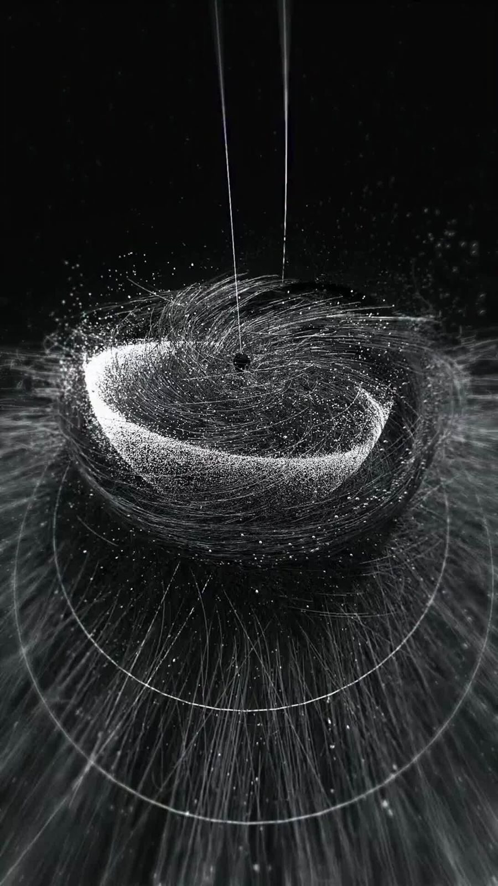

## I18 · Memorias Orgánicas

**X.F (F3 Studio, Mexico City) / x.flores___, via Rendah Mag** · Yours · Atmospheres

[Original source](https://www.instagram.com/rendahmag/reel/DdJ5kJGAH69/)

An agave hovers as a grey-white point cloud on black, labelled like a museum specimen: common name, Latin name, timecode, “escaneo3D / fotogrametría”.

**Evidence:** Rendah Mag caption says: agave from Oaxaca scanned by photogrammetry and rebuilt as a point cloud; tools vvvv and VCV Rack; shown at CMM, CENART.

**Try:** Research plan 002 · Study the label system: what does annotation add to a scan?

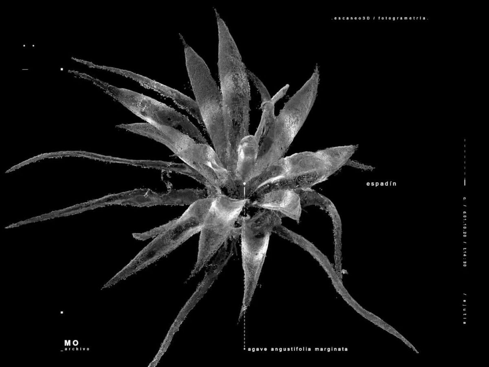

## I19 · Ployz · profile

**Ployz / plyzitron** · Yours · Motion

[Original source](https://www.instagram.com/plyzitron/)

Particle rings, plasma clouds wrapped in HUD panels and waveforms, a scanned stone head inside interface, AV sets in front of point-cloud spheres. The interface layer is as much the work as the particles.

**Evidence:** Six most recent posts inspected via the public embed on 22 Sep 2026. Profile shows TouchDesigner branding and a TouchDesigner Bangkok meetup (Aug 2026).

**Try:** Research plan 002 · Probe B: add a HUD and tracking layer over dark footage.

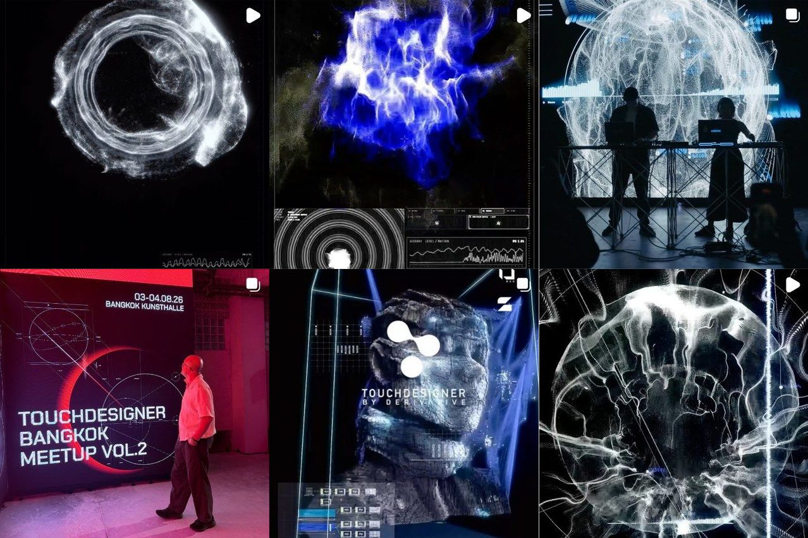

## I20 · X.F · profile

**X.F / x.flores___** · Yours · Atmospheres

[Original source](https://www.instagram.com/x.flores___/)

A projected cactus in white strands, a room-sized cage of light lines, and an archive of scanned agave species, each labelled with common and Latin names. A specimen system rather than one-off pieces.

**Evidence:** Six most recent posts inspected via the public embed on 22 Sep 2026.

**Try:** Research plan 002 · Study: how a consistent label system turns single scans into a series.

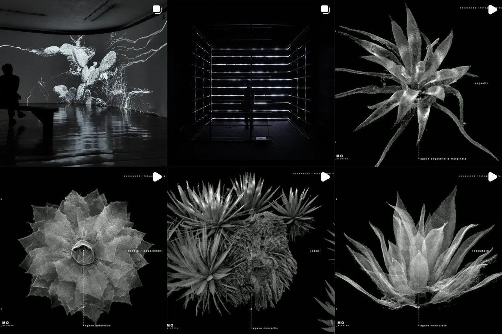

## I21 · Natural Systems Archive · botanical

**Carole Ann / caroleann.vi** · Yours · Atmospheres

[Original source](https://www.instagram.com/caroleann.vi/p/DaT1N_PiYcE/)

A fern, a crow feather, a butterfly wing and lightning as plexus point networks on black, each a numbered specimen card with a bracketed magnified inset and classification labels.

**Evidence:** Caption says: an ongoing collection exploring nature, data and generative systems; made with TouchDesigner.

**Try:** Probe A reference: the label and inset system for a spider specimen.

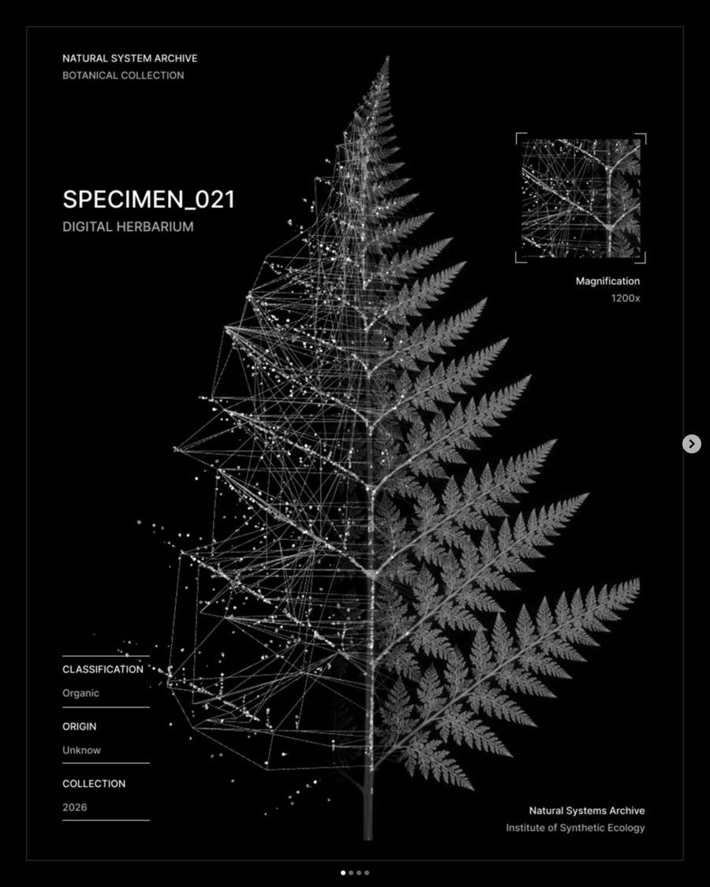

## I22 · Natural System Archive 02 · marine

**Carole Ann / caroleann.vi** · Yours · Atmospheres

[Original source](https://www.instagram.com/caroleann.vi/p/DcUxKUciYHA/)

Coral, a crayfish and a seahorse in the same specimen-card system: point networks, corner-bracket magnification, classification, origin, collection.

**Evidence:** Caption says: made with TouchDesigner.

**Try:** Study: how one consistent card turns single pieces into a series.

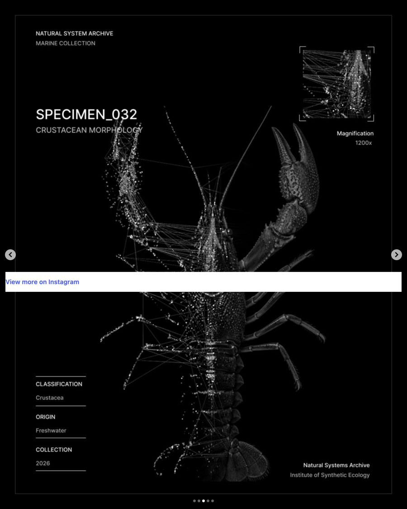

## I23 · REMAINS // AV_SYSTEM_15

**Carole Ann with Vincent Vossen (sound)** · Yours · Motion

[Original source](https://www.instagram.com/caroleann.vi/reel/DdbGUuMp2yb/)

Green tracking frames lock on to fragments of a dark, scanned-looking texture. Audiovisual.

**Evidence:** Caption says: visuals in TouchDesigner, sound by Vincent Vossen; tagged audio-reactive.

**Try:** Probe B reference: tracking frames over dark organic texture, with sound later.

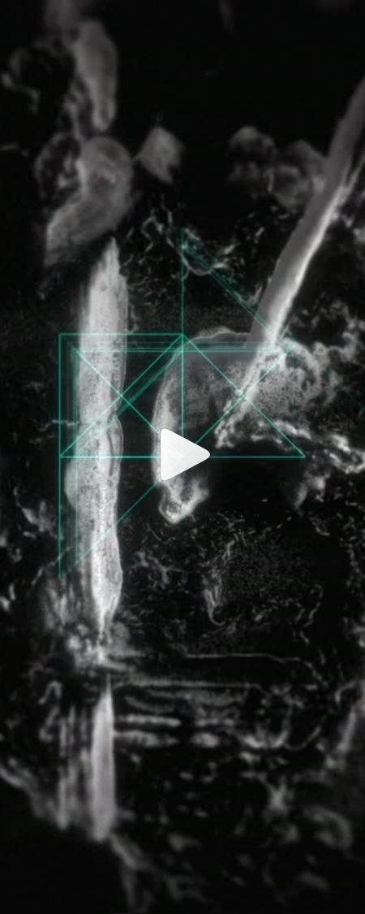

## I24 · Spiders

**Azat / azatstr** · Yours · Motion

[Original source](https://www.instagram.com/reel/DPCDkjiDNgi/)

Real macro footage of a garden spider with small tracking brackets and numbers locking on to it, glitched and sorted in places. The most-liked of the set.

**Evidence:** Caption says: made in After Effects with Motion Extractor, Pixel Sorter, Signal and Deep Glow (aescripts plugins).

**Try:** Probe B reference: tracking and glitch on real spider footage. The Motion Extractor look is a frame difference, which TouchDesigner does free.

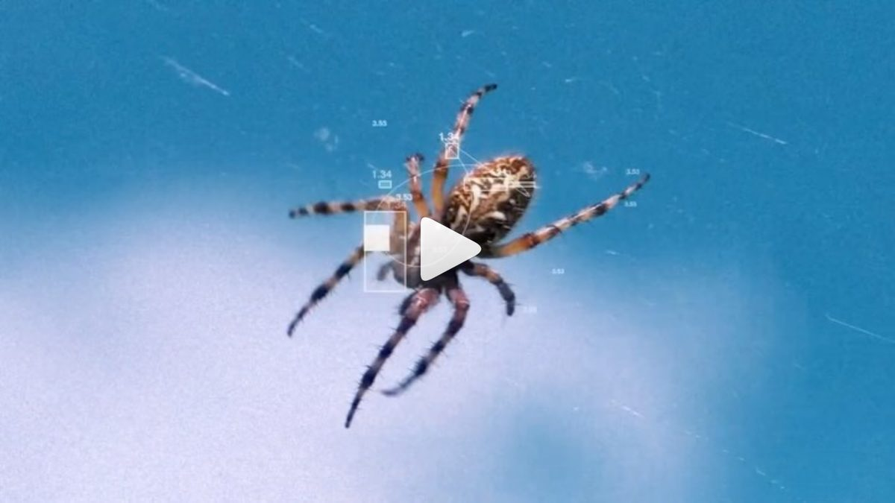

## I25 · February 2026 · data twins

**Azat / azatstr** · Yours · Motion

[Original source](https://www.instagram.com/p/DVY3ImeDO-f/)

Split frame: real footage of a peacock spider, a red flower, a tulip and an eagle on the left; the same subject re-drawn as glowing number grids with tracking circles and values on the right, joined by dashed lines.

**Evidence:** Caption names After Effects only. The jellyfish Dex saved is in this style; its post is not captured yet.

**Try:** New probe candidate: the data twin. Real nature footage beside its machine translation, in TouchDesigner.

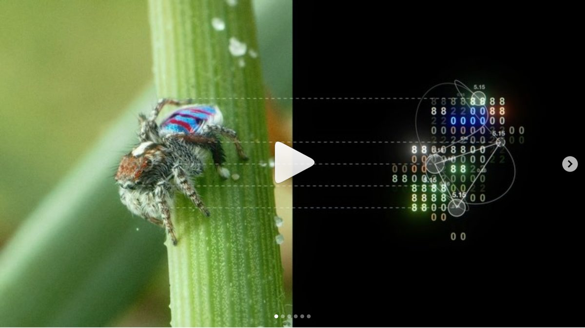

## I26 · July 2026 · tracking on the web

**Azat / azatstr** · Yours · Motion

[Original source](https://www.instagram.com/p/DbjmpBkDPap/)

A spider on its web at night, tracked with small boxes, a reticle and numeric readouts that follow it.

**Evidence:** Caption says: made with expressions from The Power of Expressions book (aescripts).

**Try:** Probe B reference: tracking readouts on a real spider at night.

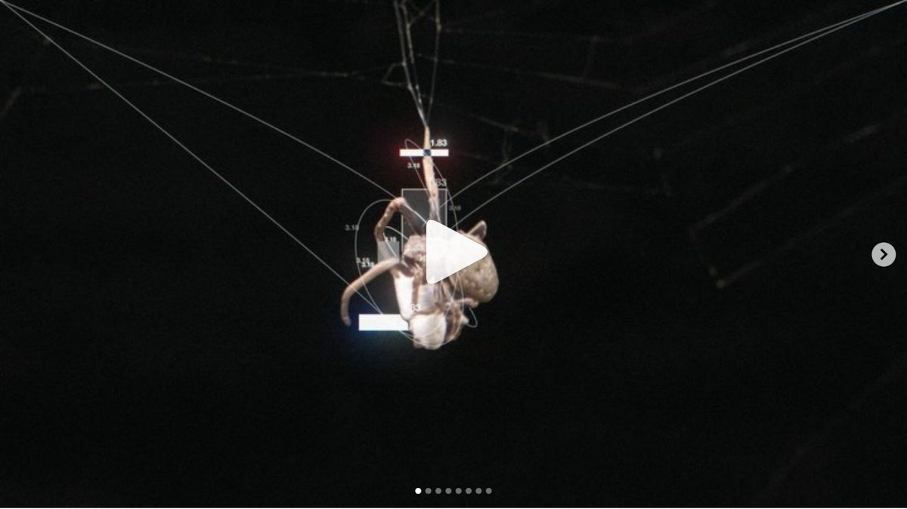

## I27 · Azat · the data-twin series

**Azat / azatstr** · Yours · Motion

[Original source](https://www.instagram.com/azatstr/)

Four more from the February and July sets: red flower, glass tulip, tulip bud and eagle, each beside its number-grid twin.

**Evidence:** Carousel slides inspected via the public embed, 22 Sep 2026.

**Try:** Study: what stays fixed across subjects (dashed links, circles, digit grid) and what changes (colour taken from the subject).

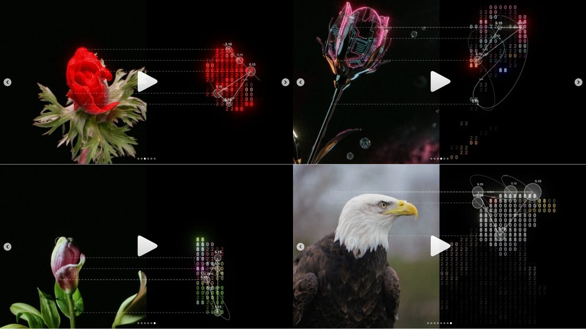

## I28 · Motion Extractor

**aescripts** · Added · Learning

[Original source](https://aescripts.com/motion-extractor/)

An After Effects and Premiere plugin that shows only what changes between frames, so still parts vanish and movement glows.

**Evidence:** Vendor listing via search: pay what you want, suggested US$39.99. Not bought; After Effects is not in the kit.

**Try:** Do it in TouchDesigner instead: Cache TOP one frame back, Difference with the live frame, threshold. Free.

## I29 · Tron: Ares · computer-vision HUDs

**Jayse Hansen (Jayse Design Group), UI design lead** · Yours · Motion

[Original source](https://jayse.io/)

A machine looks at real people and places: lock-on brackets, vital readouts, surface analysis ("SURFACE RESPONSE"), countdowns. The closest film work to the spider brief.

**Evidence:** Showreel frames via jayse.io, inspected 22 Sep 2026. Full notes: inspiration/jayse-hud-notes.md.

**Try:** HUD pass on v002: lock-on that tightens with confidence, elbowed callouts from leg joints, telemetry sidebar, scan sweep over the moss.

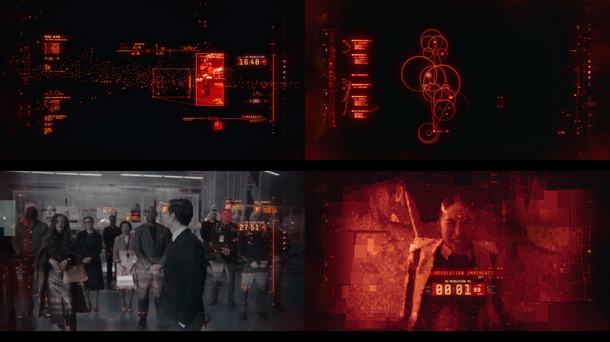

## I30 · Spider-Man: Homecoming · suit HUD

**Jayse Hansen, with Cantina Creative** · Yours · Objects

[Original source](https://jayse.io/work/spidey)

The suit HUD, whose layout grid was traced from photographs of real spider webs: nature as the interface’s skeleton.

**Evidence:** Project page on jayse.io, inspected 22 Sep 2026.

**Try:** Trace a photographed orb web and use it as the layout grid of the spider piece.

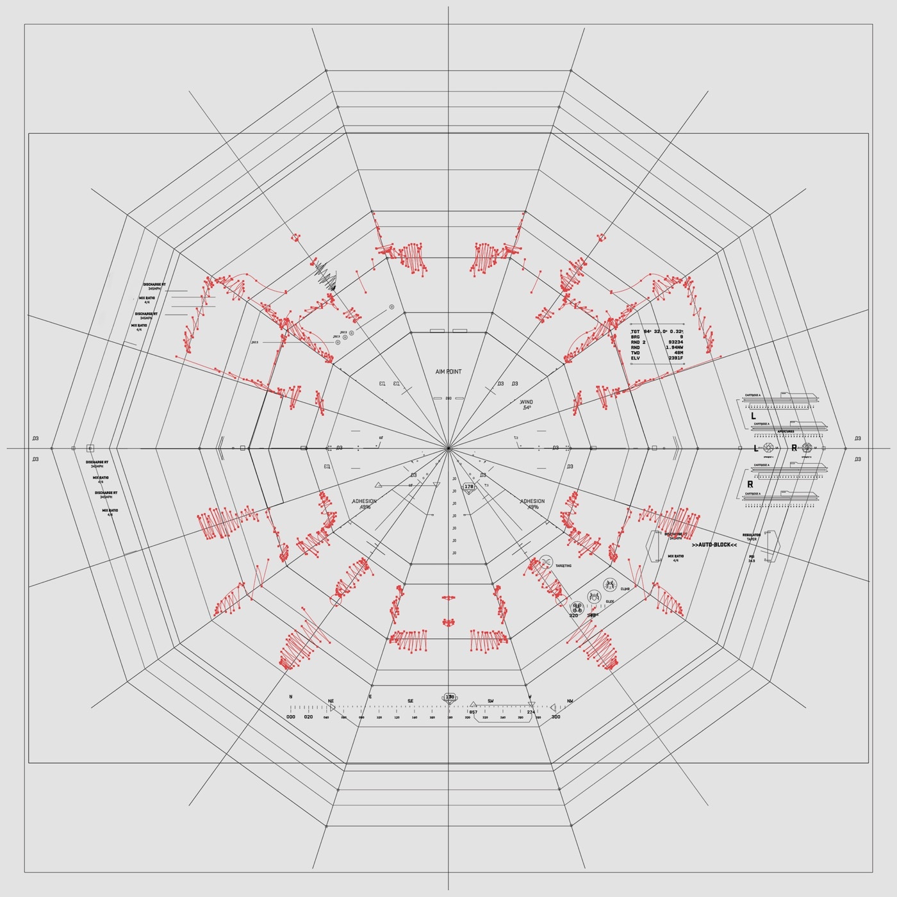

## I31 · Iron Man / Avengers HUD

**Jayse Hansen** · Yours · Web

[Original source](https://jayse.io/)

The helmet HUD language: dense edges, empty centre, one alarm colour, two type sizes.

**Evidence:** Showreel frame via jayse.io.

**Try:** Rule set for the annotation layer; see jayse-hud-notes.md.

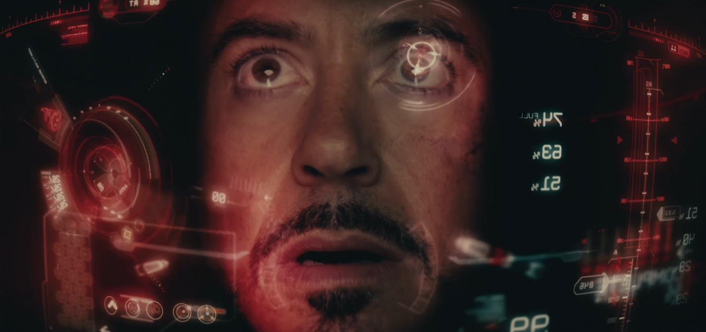

