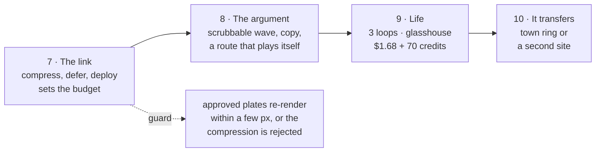

# Golden Valley: the next phases

10 Sep 2026. The four items in [the build plan](golden-valley-build-plan.md)'s
Order are done or waiting on money: the GCHQ close-up passed, the Meshy kit's
first two types are placed, the video loops need Dex's yes, and the web build
landed as task 001. This is what comes after.

## Where we actually are

The map works. Terrain, land cover, buildings, 14 km of lit paths, a wave that
carries the vale from today to 2045, 21 real buildings on the campus
footprints, and five approved photographs you can fly to and back from.

And **it runs on this container and nowhere else.** That is the whole of the
gap, and it has two halves — one mechanical, one editorial:

```
        what exists                          what is missing
  ┌───────────────────────────┐      ┌──────────────────────────────┐
  │ surveyed ground           │      │ a URL                        │
  │ the 2045 scheme           │      │ a payload a phone will take   │
  │ 21 buildings              │      │ a reason to keep watching     │
  │ 5 places, 5 photographs   │      │ anything that moves           │
  │ a wave                    │      │ proof it does this twice      │
  └───────────────────────────┘      └──────────────────────────────┘
```

Measured, not estimated — the first load today is:

| asset | now | why it is that big |
|---|---:|---|
| `gv-height-2000.bin` | 8.0 MB | 2000² of raw `uint16` |
| land cover + class PNGs | 2.0 MB | four lossless PNGs |
| footprints, paths, trees | 1.2 MB | JSON and raw buffers |
| `campus-block.glb` + `ncic.glb` | 11.9 MB | uncompressed meshes, uncompressed textures |
| the five photographs | 10.5 MB | 1672 × 941 PNG |
| **total** | **≈ 33 MB** | none of it compressed, none of it deferred |

How long that takes to first frame on a phone is **not measured**, which is
itself the finding. Step one of phase 7 is a number, not a fix.

## Phase 7 — The link

*Turn a thing that runs into a thing you can send.*

Do this first, and not because it is urgent: because it **sets the budget every
later phase has to live inside.** Compress after phase 9 and every loop, every
glasshouse and every new photograph gets made twice.

1. **Measure first.** Cold load on a throttled 4G profile at 390 px: time to
   first frame, time to the full scene, sustained fps while the wave sweeps.
   Write the numbers down before touching anything.
2. **Spend the budget where the bytes are.** Terrain to a 16-bit heightmap
   (the route `lidar_to_heightmap.py` already knows), GLBs through Draco and
   KTX2, photographs to AVIF/WebP, land cover to WebP.
3. **Defer everything that is not the vale.** The photographs are not first-load
   assets — they belong to a place you have not clicked yet. Terrain and ground
   first, then buildings, then trees, then models, then a photograph on demand.
4. **Put it somewhere.** A static host, one URL, and the licence credits intact.

**The guard, because compression is a silent vandal:** the approved plates get
re-rendered from their own sidecars after every compression step and measured
against the originals. `measure_leg_anchors.py` already projects surveyed
features into a plate's pixels; the escarpment's silhouette and the NCIC's
meadow roof are the two things a requantised heightmap and a crushed normal map
will quietly ruin. **A compression that moves an approved plate by more than a
few pixels is rejected, however many megabytes it saved.**

**Done when:** Dex opens a URL on his phone, on mobile data, and the vale is
there before he wonders whether it is broken — with the numbers from step 1
re-measured to prove it.

## Phase 8 — The argument

*The map shows. It does not yet say anything.*

A client watching today sees a well-made technical demo. The scheme's case —
sixty per cent green space, a cyber campus that does not eat the vale, a
landscape that is more wooded in 2045 than in 2026 — is **in the data and
nowhere on the screen.**

- **The wave becomes a control, not an event.** Right now it is a button that
  fires once. The idea of the whole piece is dragging the future across the
  vale and stopping half way, watching one field become an orchard while the
  next is still stubble. A year dial, 2026 ⟷ 2045, scrubbable both ways. The
  shader already takes a continuous front; only the UI is missing.
- **Copy per place, ~80 words**, and the numbers the scheme has earned:
  77.4 ha across 29 fields, 29% orchard, 20.5% wetland, built area capped at a
  third.
- **A guided route.** Someone who touches nothing should still get the story:
  an ordered run through the five places, along the paths that already exist,
  so the map plays itself.

**Done when:** someone who has never seen it watches for ninety seconds without
touching anything and can say back what the scheme is.

## Phase 9 — Life in the frames

*Everything in the approved photographs is holding perfectly still.*

- **The three loops**, from the build plan §4 — agrivoltaics, GCHQ, the
  courtyards. Locked camera, 5 s, first frame as last frame. **$1.68, awaiting
  Dex's yes.** They play inside a place you have already flown to, which is why
  they come after phase 8, not before.
- **The rest of the kit**: the glasshouse (type c, 3 placements) so the
  glasshouse-quarter plate stops failing the no-empty-frames rule, and terraces
  (type d) if the homes ever need to be seen from below. 70 credits.
- **Re-brief 004** and the glasshouse plate through the `generate/` queue.

**Done when:** the glasshouse quarter passes the rule that the campus close-up
now passes, and the places breathe.

## Phase 10 — Proof it transfers

*One exemplar is a portfolio piece. Two is a service.*

Everything from the LiDAR tile to the rule-based 2045 scheme is a script with a
bounding box at the top of it. Nothing in it knows it is Cheltenham. The way to
prove that to a prospective client is to point it somewhere else and say how
long it took.

Two candidates, and they buy different things:

- **The town ring** (Promenade, Pittville, Montpellier) — the tourism and
  architecture exemplar, real places and Dex's own photography. Needs nobody's
  permission, which is exactly why the build plan put it there.
- **A second development site** — the residential-developer pitch, in their
  words: *your site, and here is the same thing three weeks later.*

**Done when:** a second bounding box runs the pipeline end to end and the time
it took is written down.

## The order, and the one argument against it



The case for putting **8 before 7**: if the next thing in the diary is a client
meeting, the argument wins the work and the load time does not. Take it — but
know the cost, which is that every asset phase 8 and 9 create gets made at
today's weights and compressed later, twice.

## Still parked, deliberately

Far-field terrain. "Before" frames. Transitions of any kind — blur zooms were
ruled out on 10 Sep and no tooling for them exists to be tempted by. Car-park
ranks, which are the 002 audit's finding and which Dex has called boring.

---

## Phase 7 — result, 10 Sep 2026

**25.62 MB and 25.15 seconds became 7.66 MB and 3.27 seconds.** Measured both
times by `scripts/measure_payload.py` on a cold open at 390 × 844 over a
9 Mbit/s connection with 85 ms of latency and no cache. The guard says the
worst-affected approved plate moved **0.60%** of its pixels against a 1%
tolerance, and the plate with no models in it moved **0.04%**.

| | as found | after |
|---|---:|---:|
| first load | 25.62 MB | **7.66 MB** |
| time to first frame | 25.15 s | **3.27 s** |
| time to the whole world | 25.15 s | 15.53 s |

Three separate things did that, and they are worth keeping apart.

### The formats, which is where the bytes were

Plain gzip over the whole set bought 14% and no more: almost everything was
already a compressed format or high-entropy binary, so this was never a
transport problem.

| | was | now | how |
|---|---:|---:|---|
| heightmap | 7.63 MB | 1.98 MB | 12-bit, predicted, gzipped |
| the two GLBs | 11.32 MB | 1.63 MB | 1024² WebP texture, meshopt geometry |
| land cover and class | 1.93 MB | 0.79 MB | WebP — lossy for colour, lossless for indices |
| the photographs | 17.0 MB | 2.75 MB | WebP, and not on first load at all |
| footprints | 0.94 MB | 0.16 MB | untouched; the host's own gzip does it |

The heightmap is the one worth explaining, because it is the file the whole
map stands on. It held uint16 over a **34.96 m** elevation span — a step of
**0.53 mm**, from a survey accurate to about 15 cm. Fifteen of its sixteen bits
were describing noise. Twelve bits gives 0.85 cm, and the measured median
difference between neighbouring cells *in that same file* is 2.19 cm, so the
quantisation is 2.6× finer than the ground's own roughness and cannot terrace
a field the LiDAR has not already terraced. Ten bits (3.42 cm) would be coarser
than that median, which is why this stopped at twelve rather than at "as small
as possible". Each sample is then predicted from the average of its left and
upper neighbours and the residual gzipped. It is deliberately **not** an image:
an image comes back through a canvas, and a canvas is where colour management
lives — a terrain that shifts by a colour profile is exactly the silent drift
this experiment spends its time hunting.

Nothing was simplified. The models keep every triangle, because the NCIC's
meadow roof is a silhouette and simplification is where silhouettes go to die.

### The order, which is where the seconds were

`buildWorld` awaited the terrain, the land cover, four thousand footprints, the
2045 scheme and two GLBs before drawing a single pixel. It now hands the scene
back at each stage and the page draws it, so the vale appears as soon as the
heightmap has landed and the rest grows in while you are already looking at
Cheltenham. On the *original* assets that change alone took first frame from
25.15 s to 8.46 s — worth stating separately, because it means most of the
twenty-five seconds was never about file size. Alongside it,
`gv-buildings.json` stopped being fetched at module scope, where a top-level
await holds up every module that imports it, including the one that draws the
ground.

### What the guard caught, and what the guard got wrong

The guard's first verdict was REJECT. It was wrong, and finding out why was
the most useful hour of the phase.

1. **It was measuring the weather.** The vale has a flock in it, wind in the
   canopy and cloud shadows crossing the fields, all functions of how long the
   page happened to take to be ready. Two runs of *identical code* disagreed by
   1.5% of their pixels. Pinning the world clock made two runs bit-identical,
   and only then was the instrument worth reading.
2. **8 MB of phantom bytes.** A texture inside a GLB is handed to the loader as
   a `blob:` URL and comes back through the network listener as if it had been
   downloaded, so the first baseline billed the models twice.
3. **A server that does not gzip is not a phone's server.** Without it the
   measurement would have sent us optimising footprints that already arrive at
   17% of their size.
4. **Drawing while building costs building.** Rendering every frame during the
   load pushed the last stage from 68 s to past 110 s on this container's
   software renderer. It draws once per stage now.

The final verdict, on the plates: worst 0.60%, and amplified six times the
difference image is still nearly black — thin traces along the agrivoltaic
panel rows and the hedge lines, which is edges shading differently, not
features moving. The GCHQ plate, which has no models in it and therefore tests
only the terrain and the land cover, moved 0.04%.

### Two defects found by running the suites, neither of them compression

- **An invisible stem was eating clicks on GCHQ.** A place marker is a label
  with a line drawn down to the ground, and the line was part of the button —
  so every marker claimed 25 px of the map below itself, which at GCHQ is
  exactly where the descent hotspot stands. The descent had been unreachable
  since the markers landed. The line is decoration now and the label carries
  the target. `test_places.py` was measuring the marker's box, so it had gone
  on reporting a comfortable 68 px for something with no target below the
  label at all; it measures what a thumb can hit now, and reports 50 px.
- **A loaded clip was being rejected.** The descent player raced a
  `loadeddata` listener against a 25-second timer, and on a machine whose
  frames take seconds the timer won a clip that had already arrived —
  readyState 4, a decoded 1280 px frame sitting there, and the descent falling
  back to flying live because the message saying so was queued behind a long
  task. Events and timers are different task queues and neither promises to go
  first. It polls `readyState`, which is the ground truth, and the event now
  only wakes the check early.

### What is not done: where it goes

`scripts/build_site.py` assembles the whole thing as a folder — **10.53 MB
public, 12.15 MB for a pitch** — and copies nothing else out of a repository
that also holds LiDAR intermediates, session notes and other people's
copyrighted renders.

**The campus models cannot go on the open web.** `campus-block.glb` and
`ncic.glb` derive from drawings that derive from HBD's and Grimshaw's published
renders, and `meshy/README.md` says pitch work only. So the build leaves them
out unless asked for by name with `--internal`, and the map is built to survive
their absence — a family whose model is missing keeps its extrusions, so the
public build is a working map with a blockier campus rather than an empty
field.

That made hosting a decision rather than a chore, and **Dex chose public**:
the extrusions, linkable anywhere. So the deployment is
`.github/workflows/pages.yml` — it runs `build_site.py` **without**
`--internal` on every push to `main`, refuses the run outright if a `.glb` or
anything from `inspiration/` or `meshy/` reaches the folder, and hands the
result to GitHub Pages. The public first load is **6.69 MB**.

`scripts/test_public_build.py` (9/9) opens that folder and nothing else, the
way a stranger would: nothing 404s, nothing errors, no model is placed, the
campus keeps its extrusions, all five places are there and 2045 still arrives.
It caught the one thing the design had not thought about — the map used to
discover the models were missing **by asking for them**, which is two 404s in
everyone's console on every load. Availability is written in
`golden-valley/models.json` now and the build rewrites it, so a public map
knows what it has instead of probing for what it hasn't.

**Two things still need Dex, and only Dex.** Merging PR #1 to `main`, and
setting Pages' source to GitHub Actions in the repository settings — a
workflow cannot turn Pages on for a repository that has never had it. And one
caveat worth knowing before clicking: **this repository is private, and
GitHub Pages on a private repository needs a paid plan.** If the run fails on
that, the fallback that keeps `inspiration/` private is a second, public
repository holding only the built site, which the same workflow can push to.

Nothing has been uploaded from here. `dist/` is built and ignored by git.

### One number that is not a number

Frame times here come from SwiftShader, on a container with no GPU, at seconds
per frame. They are a **relative** measure — same renderer before and after a
change — and no scaling factor turns them into a phone. Bytes transfer; the
network-bound part of the timings transfers; the frame rate does not. Phase 8
should put this in front of a real handset once, and write down what it says.

### Tests

`test_heightmap.py` **6/6** (new — the codec decoded by node and by python must
agree byte for byte, and re-encoding must reproduce the shipped file exactly),
`test_places.py` **16/16**, `test_path_network.py` **12/12**,
`test_hotspot_flow.py` **all passing**, `test_world_clock.py` passing,
`test_public_build.py` **9/9** (new — the published folder, served on its own).
`guard_plates.py` is new and is the thing to run either side of any future
change to an asset.
