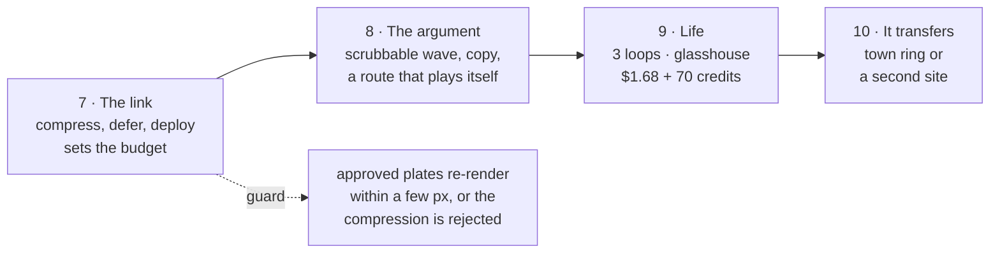

# Golden Valley: the next phases

10 Sep 2026. The four items in [the build plan](golden-valley-build-plan.md)'s
Order are done or waiting on money: the GCHQ close-up passed, the Meshy kit's
first two types are placed, the video loops need Dex's yes, and the web build
landed as task 001. This is what comes after.

## Where we actually are

The map works. Terrain, land cover, buildings, 14 km of lit paths, a wave that
carries the vale from today to 2045, 21 real buildings on the campus
footprints, and five approved photographs you can fly to and back from.

And **it runs on this container and nowhere else.** That is the whole of the
gap, and it has two halves — one mechanical, one editorial:

```
        what exists                          what is missing
  ┌───────────────────────────┐      ┌──────────────────────────────┐
  │ surveyed ground           │      │ a URL                        │
  │ the 2045 scheme           │      │ a payload a phone will take   │
  │ 21 buildings              │      │ a reason to keep watching     │
  │ 5 places, 5 photographs   │      │ anything that moves           │
  │ a wave                    │      │ proof it does this twice      │
  └───────────────────────────┘      └──────────────────────────────┘
```

Measured, not estimated — the first load today is:

| asset | now | why it is that big |
|---|---:|---|
| `gv-height-2000.bin` | 8.0 MB | 2000² of raw `Float32` |
| land cover + class PNGs | 2.0 MB | four lossless PNGs |
| footprints, paths, trees | 1.2 MB | JSON and raw buffers |
| `campus-block.glb` + `ncic.glb` | 11.9 MB | uncompressed meshes, uncompressed textures |
| the five photographs | 10.5 MB | 1672 × 941 PNG |
| **total** | **≈ 33 MB** | none of it compressed, none of it deferred |

How long that takes to first frame on a phone is **not measured**, which is
itself the finding. Step one of phase 7 is a number, not a fix.

## Phase 7 — The link

*Turn a thing that runs into a thing you can send.*

Do this first, and not because it is urgent: because it **sets the budget every
later phase has to live inside.** Compress after phase 9 and every loop, every
glasshouse and every new photograph gets made twice.

1. **Measure first.** Cold load on a throttled 4G profile at 390 px: time to
   first frame, time to the full scene, sustained fps while the wave sweeps.
   Write the numbers down before touching anything.
2. **Spend the budget where the bytes are.** Terrain to a 16-bit heightmap
   (the route `lidar_to_heightmap.py` already knows), GLBs through Draco and
   KTX2, photographs to AVIF/WebP, land cover to WebP.
3. **Defer everything that is not the vale.** The photographs are not first-load
   assets — they belong to a place you have not clicked yet. Terrain and ground
   first, then buildings, then trees, then models, then a photograph on demand.
4. **Put it somewhere.** A static host, one URL, and the licence credits intact.

**The guard, because compression is a silent vandal:** the approved plates get
re-rendered from their own sidecars after every compression step and measured
against the originals. `measure_leg_anchors.py` already projects surveyed
features into a plate's pixels; the escarpment's silhouette and the NCIC's
meadow roof are the two things a requantised heightmap and a crushed normal map
will quietly ruin. **A compression that moves an approved plate by more than a
few pixels is rejected, however many megabytes it saved.**

**Done when:** Dex opens a URL on his phone, on mobile data, and the vale is
there before he wonders whether it is broken — with the numbers from step 1
re-measured to prove it.

## Phase 8 — The argument

*The map shows. It does not yet say anything.*

A client watching today sees a well-made technical demo. The scheme's case —
sixty per cent green space, a cyber campus that does not eat the vale, a
landscape that is more wooded in 2045 than in 2026 — is **in the data and
nowhere on the screen.**

- **The wave becomes a control, not an event.** Right now it is a button that
  fires once. The idea of the whole piece is dragging the future across the
  vale and stopping half way, watching one field become an orchard while the
  next is still stubble. A year dial, 2026 ⟷ 2045, scrubbable both ways. The
  shader already takes a continuous front; only the UI is missing.
- **Copy per place, ~80 words**, and the numbers the scheme has earned:
  77.4 ha across 29 fields, 29% orchard, 20.5% wetland, built area capped at a
  third.
- **A guided route.** Someone who touches nothing should still get the story:
  an ordered run through the five places, along the paths that already exist,
  so the map plays itself.

**Done when:** someone who has never seen it watches for ninety seconds without
touching anything and can say back what the scheme is.

## Phase 9 — Life in the frames

*Everything in the approved photographs is holding perfectly still.*

- **The three loops**, from the build plan §4 — agrivoltaics, GCHQ, the
  courtyards. Locked camera, 5 s, first frame as last frame. **$1.68, awaiting
  Dex's yes.** They play inside a place you have already flown to, which is why
  they come after phase 8, not before.
- **The rest of the kit**: the glasshouse (type c, 3 placements) so the
  glasshouse-quarter plate stops failing the no-empty-frames rule, and terraces
  (type d) if the homes ever need to be seen from below. 70 credits.
- **Re-brief 004** and the glasshouse plate through the `generate/` queue.

**Done when:** the glasshouse quarter passes the rule that the campus close-up
now passes, and the places breathe.

## Phase 10 — Proof it transfers

*One exemplar is a portfolio piece. Two is a service.*

Everything from the LiDAR tile to the rule-based 2045 scheme is a script with a
bounding box at the top of it. Nothing in it knows it is Cheltenham. The way to
prove that to a prospective client is to point it somewhere else and say how
long it took.

Two candidates, and they buy different things:

- **The town ring** (Promenade, Pittville, Montpellier) — the tourism and
  architecture exemplar, real places and Dex's own photography. Needs nobody's
  permission, which is exactly why the build plan put it there.
- **A second development site** — the residential-developer pitch, in their
  words: *your site, and here is the same thing three weeks later.*

**Done when:** a second bounding box runs the pipeline end to end and the time
it took is written down.

## The order, and the one argument against it



The case for putting **8 before 7**: if the next thing in the diary is a client
meeting, the argument wins the work and the load time does not. Take it — but
know the cost, which is that every asset phase 8 and 9 create gets made at
today's weights and compressed later, twice.

## Still parked, deliberately

Far-field terrain. "Before" frames. Transitions of any kind — blur zooms were
ruled out on 10 Sep and no tooling for them exists to be tempted by. Car-park
ranks, which are the 002 audit's finding and which Dex has called boring.
