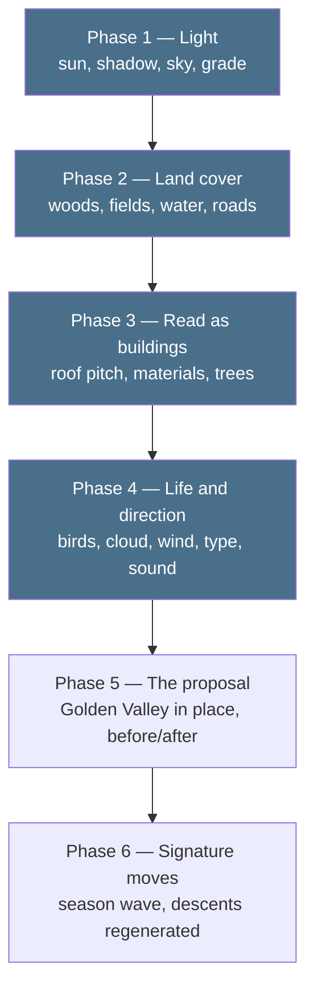

# The living map: from massing model to the thing we actually want

Written because the honest answer to "I can't see the vision" is that the
vision isn't there yet — and the reason is specific and fixable.

## What we have built, and what we have not

Every session so far has gone into **structure**, and none into **surface**.

| | state |
|---|---|
| Terrain, real and surveyed | done — EA LiDAR at native 1 m, true scale |
| Buildings at measured heights | done — 4,033 of them, DSM minus DTM |
| Georeferencing you can trust | done — real businesses at real coordinates |
| The descent mechanism | done and measured — seams, fades, fallbacks |
| **Light, shadow, grade** | Phase 1 — proved |
| **Land cover: woods, fields, water, roads** | **Phase 2 — done** |
| **Trees: woods, hedges, street trees** | **done — 9,181 instances** |
| **Buildings that read as buildings** | **Phase 3 — done** |
| **Weather, birds, movement** | **Phase 4a — done** |
| **Art direction, typography, sound** | **Phase 4b — done, bar sound** |
| **The Golden Valley proposal itself** | not started — the site is an empty field |

Structure was the right order. It is the part that cannot be faked, it is
what makes this defensible against a studio hand-modelling a pretty hill, and
everything below is *dressing* that only works because the bones are real.
But it means that until today every render looked like a planning document,
because that is exactly what an unlit massing model is.

## Reframing what we are aiming at

Primland is a hand-crafted world: a studio, months, an artist placing things.
We will not out-craft that, and we should not try.

What we have that they do not is that **ours is measured, real and
repeatable**. Point the pipeline at a different postcode and a different
client and you get the same fidelity a week later. The goal is therefore not
"look like Primland" — it is *Primland's feeling, on a real surveyed place,
reproducible for any site*. That is the thing worth selling to a developer,
a council or an architecture practice.

## The phases



### Phase 1 — Light *(proved, needs adopting)*

A low afternoon sun casting real shadows, filmic tone mapping, a graded sky
the fog agrees with, and ground colour driven by height and slope rather than
a flat blend. No new data at all. Live in `experiments/002-living-map/lookdev/`.

**Buys:** massing model → architectural render. The single biggest jump per
unit effort in the whole list.
**Cost:** done. Adopting it means re-rendering the descent anchors and the
control clip, because the seam measurements compare pixels — one command,
about five minutes, free.

### Phase 2 — Land cover and roads *(done)*

The ground was one green blanket. Real ground is woodland, playing fields,
farmland with hedge boundaries, water, car parks, and a road network, and
OpenStreetMap had all of it in the box we had already fetched — 327 polygons
and 1,484 lines, no new download.

`scripts/golden_valley_landcover.py` rasterises them into a 1 m/texel colour
image of the ground with the roads drawn in at their real widths, which is
the decision worth keeping: a 4 m service road is *narrower than the terrain
mesh's own 2 m triangles*, so as geometry it would z-fight and crawl, while
as texels it is exact, anti-aliased and free.

```
      OSM ways/relations            gv-landcover.png             the map
 ┌──────────────────────────┐   ┌──────────────────────┐   ┌───────────────┐
 │ 327 area polygons        │   │ 2000 x 2000, 1 m per │   │ terrain mesh  │
 │ 1484 lines (roads,       ├──▶│ texel, drawn at 2x   ├──▶│ .map =        │
 │ streams, hedges)         │   │ and box-downsampled  │   │  land cover   │
 │ 540 surveyed trees       │   │ 605 KB PNG           │   │ vertex colour │
 └──────────────────────────┘   └──────────────────────┘   │  = slope only │
                                └── gv-trees.bin, 72 KB ──▶│ InstancedMesh │
                                                           └───────────────┘
```

The vale now covers 31.7 % residential, 22.9 % farmland, 10.5 % amenity
grass, 7.1 % meadow, 9.4 % carriageway, 4.5 % woodland, 3.0 % park and
0.66 % water — which is west Cheltenham, and it is measured rather than
art-directed.

**Bought:** the vale stopped being a lawn. Second biggest jump, as predicted.
**Cost:** one pass. Free — OSM data, ODbL, already attributed.

### Phase 3 — Buildings that read as buildings *(done)*

**Trees are in.** 9,181 instances in three families — 6,211 broadleaf
scattered on the woodland and park polygons and through residential gardens,
2,618 hedge blobs along OSM's hedge lines, 352 scrub — plus OSM's 540
individually surveyed trees, all in one 72 KB file of 8-byte records. The
records carry no Y: the map reads each trunk's ground height from the same
height field the terrain is built from, so a tree cannot float or sink if
either ever changes. Three draw calls for the lot.

**And the buildings now have roofs.** We were keeping the *median* height
inside each footprint and throwing the distribution away; the DSM held the
eaves and the ridge all along. `scripts/golden_valley_roofs.py` recovers
both — 2,658 gables, 735 hips, 640 flat — along with the ridge *direction*,
which is measured rather than assumed, and that turned out to matter:

> The obvious prior is that a ridge runs along a building's long axis. In
> this box it does not, 62 % of the time. A British semi or terraced house is
> narrow-fronted and deep, and its ridge runs with the **street** — across
> its own footprint's long axis. Assuming the long axis would have laid every
> terrace in Hesters Way at right angles to the road it faces.

The same two numbers tell a gable from a hip: if the surface falls away in
one direction and stays level in the other, the ends are vertical and the
ridge runs the full length; if it falls away in both, the ends are hipped.

Materials come from the OSM `building` tag, with the 1,781 footprints tagged
only `yes` inferred from the land cover Phase 2 put underneath them, the
footprint area and whether the roof measured pitched. Walls stay in a narrow
off-white range on purpose — the proposition is a measured architectural
model, and 4,000 brick-red houses would trade that for a video game — so the
five families carry their difference in the roofs, which is what you see from
the air anyway.

**Bought:** the last of the "architectural competition entry" look.
**Cost:** one pass. Free.

### Phase 4a — Life *(done)*

Cloud shadows drifting across the vale, wind in the trees with amplitude by
height, water that catches the sun and ripples, and ninety birds actually
flocking. The land class image Phase 2 wrote and nothing read is what tells
the water where it is — no second material, no mask painted by hand.

The interesting part was not the effects, it was the clock. Everything before
this was still, and the descent's whole premise is that a pre-rendered clip
and the live canvas show the same place at the same instant. Anything driven
by `performance.now()` would put them at different moments of the same
afternoon, and no fade hides a cloud shadow in the wrong place. So the world
has exactly one clock:

```
   the map          updateLife(worldSeconds())      wall time, rebaseable
   the capture      updateLife(i / fps)             frame by frame
   a descent        pinWorld(floor(t·fps) / fps)    the clip's own frame
                    releaseWorld(clipSeconds)       carries on, never snaps
```

The flock is the awkward case, because a simulation remembers: it steps at a
fixed 1/60 s and rewinds to a seeded start whenever time runs backwards, so
asking for t = 3.958 s twice gives the same ninety birds in the same places.
`scripts/test_world_clock.py` is the check that has to keep passing if
anything else moving is ever added.

**It cost nothing at the seam.** Re-running the capture against a world with
weather, wind, water and a flock in it:

| | before Phase 4 | after |
|---|---|---|
| in-seam | 0.704 % | 0.700 % |
| out-seam | 0.940 % | 0.938 % |

**Bought:** the map stops being a render of an afternoon and becomes one.
**Cost:** one pass. Free.

### Phase 4b — Art direction *(done)*

The direction was settled by the brief itself: **keep it close to the
inspiration**. So rather than inventing one, I went and looked at what
explore.ownprimland.com actually does — its stylesheet, not a description of
it — and took the register.

| | the reference | ours |
|---|---|---|
| display | Inferi *(Blaze Type, licensed)* | Cormorant Garamond *(OFL)* |
| interface | Centra *(Sharp Type, licensed)* | Jost\* *(OFL)* |
| ground | warm paper `#fffbe7` `#fffdf3` | `#f7f2e6` |
| greens | sage `#798d73` `#4a6b4a` | `#7c8c6f` `#445041` |
| accent | burnt amber `#a8611a` | `#a4611f` |

What is borrowed is the register — a high-contrast display serif against a
geometric sans, warm paper, sage and burnt amber, an interface restrained
enough that the landscape carries the work. What is not borrowed is anything
proprietary: their faces are commercial, ours are open licence and vendored
so the map renders identically offline, and our palette is sampled from the
world itself — the farmland green the terrain is painted with, the warmth of
the `0xffe0b5` sun, the slate the Doughnut is picked out in.

Four things changed:

- **The opening.** A title over a landscape that is already moving — the
  camera eases in for fifteen seconds behind the words, so by the time they
  have gone the map is somewhere you have watched rather than a thing you
  have been handed. Their device exactly: a tracked-out overline, a big
  serif name with one word in italic, one line of invitation, and an
  *Explore the map* pill.
- **Markers that are planted, not floating.** A pin on the ground, a hairline
  stem, and the label above it — the stem is the whole difference between a
  label that belongs to a point on the map and browser chrome sitting on top
  of a picture. They fade with distance, because three labels shouting
  equally from a 2 km box is a legend, not a place.
- **The place panel** in cream, with the name in the display serif and the
  attribution stepping aside rather than disappearing when it opens — OGL and
  ODbL both require it to stay visible.
- **A shallow bottom vignette**, doing two jobs: seating the credit line
  against sunlit farmland, which is the one place on this map where cream
  type has nothing to sit on, and giving a still the bottom weight it needs.

**Still missing: sound.** The reference opens with ambient nature audio and a
*start without audio* link, and that is clearly right — but it needs an
actual recording, and shipping the control without the file would be a dead
switch. It is the one part of this phase waiting on an asset rather than a
decision.

**Bought:** it stops looking like a tool.
**Cost:** one pass. Free — two open-licence typefaces, 168 KB vendored.

### Phase 5 — The proposal itself

Right now the Golden Valley hotspot descends onto **an empty field**, which is
honest but useless as an exemplar. HBD and the council want to see what is
being *proposed* there. This phase places the masterplan in the map — massing
at minimum, their renders and video where they exist — with a before/after
toggle between the surveyed present and the proposed future.

**Buys:** the actual pitch. Everything before this is a beautiful map of what
already exists; this is the first phase that shows a client their own scheme.
**Cost:** one session once we have material. **Blocked on you** — this needs
their masterplan drawings, massing or renders.

### Phase 6 — The signature moves, at quality

The season wave and the generated descents, done last on purpose.

**Generated video is capped by the frame you hand it.** Session B's clip is a
convincing descent *of a white model*, because frame A was a white model. Buy
clips now and we buy expensive footage of an unfinished world, then pay again
after every look change. Once Phases 1–5 land, the same pipeline — unchanged —
produces descents of a place worth descending into.

**Buys:** the two things that make this not-a-map.
**Cost:** the season wave is a shader session, free. Descents are a few pounds
per hotspot at the rates Session B measured, and want re-running after any
look change.

## The one thing that changes the order

If a pitch date lands, Phase 5 jumps the queue: a client will forgive a
plain-looking map that shows *their scheme*, and will not forgive a beautiful
map that does not.

## The adoption debt — paid

Phases 1–3 all live in `experiments/002-living-map/lookdev/`, and the map page
still runs the old flat look. That was deliberate, not neglect: the descent
seam is measured *in pixels*, so the moment the world's appearance changes,
`descent/frames/*.png`, the control clip and `seam-report.json` are all stale.
Holding the changes in one place meant paying that cost once instead of three
times.

`golden-valley/gv-buildings.json` is the one shared file the three phases
touched, and the roof pass only *added* fields to it: `ring`, `holes`, `base`
and `height` are recomputed and asserted identical, and the script refuses to
write if any of the 4,033 disagree. So the map page renders exactly what it
rendered yesterday, and the seam numbers still stand.

Done. `golden-valley/scene.js` now exports `buildWorld({ renderer })`, and the
map page, the seam test and the lookdev harness all call it — one world, so
the live canvas and a pre-rendered descent can never disagree about what the
place looks like. `look.js` moved into `golden-valley/` with it; lookdev/ is
now purely the comparison harness that makes the before-and-after sheets.

Re-measuring the seam was the interesting part:

| | white model | with land cover, trees and roofs |
|---|---|---|
| perfect landing | 0.464 % | 0.940 % |
| 5 m of drift | 2.496 % | 7.736 % |
| 10 m of drift | 3.559 % | 8.997 % |
| delivery clip at crf 24 | 1.84 MB | 5.09 MB |

Session B's finding — that the seam is driven by **detail density** — was
made on a generated clip and is now confirmed on our own control clip, which
is perfect by construction. Landing accuracy matters about three times as
much as it did.

Codec quality was the other thing that changed, and it changed less than it
looks. The delivery encode now sits 0.37 points above the near-lossless one
where it used to sit 0.08 above, so codec error more than quadrupled — but
against a landing penalty that tripled, so the ratio holds. Measuring the
whole curve settled it: crf 32 halves the download to 2.87 MB for 0.16 of a
point at the seam, where five metres of drift costs seven. **Bitrate is still
not what breaks a hand-off**, and the delivery encode moved to crf 32.

## Immediate next step

**The season wave**, which the reference makes the case for better than this
plan did. Its own signature move is a toggle that shifts the landscape from
summer to autumn, and we are unusually well placed to do it: `gv-landclass.png`
already says which texels are woodland, which are farmland and which are mown
grass, the tree instances already carry a kind, and Phase 4a built the clock
it would run on. A palette per class per season, and the wave crosses the
vale rather than cutting.

Then, in any order:

- **Phase 5, the proposal** — still blocked on HBD or council material, and
  still the one that jumps the queue the moment a pitch date lands.
- **Ambient sound** — the last piece of Phase 4b, waiting on a recording
  rather than a decision.
- **Phase 6, generated descents** — newly worth buying. Both anchor frames
  were re-rendered on 9 Sep, so a generator now starts from a real-looking
  place rather than a clay model, and `--style clay` is probably the wrong
  default. The Kling clip in `descent/fal/` is a record of the old world, not
  a comparison against this one.

