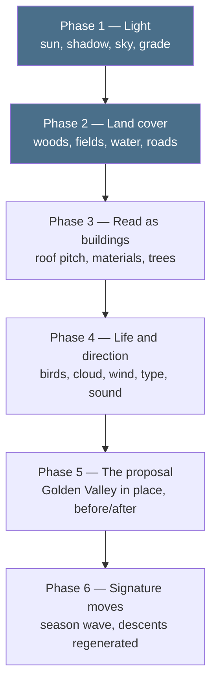

# The living map: from massing model to the thing we actually want

Written because the honest answer to "I can't see the vision" is that the
vision isn't there yet — and the reason is specific and fixable.

## What we have built, and what we have not

Every session so far has gone into **structure**, and none into **surface**.

| | state |
|---|---|
| Terrain, real and surveyed | done — EA LiDAR at native 1 m, true scale |
| Buildings at measured heights | done — 4,033 of them, DSM minus DTM |
| Georeferencing you can trust | done — real businesses at real coordinates |
| The descent mechanism | done and measured — seams, fades, fallbacks |
| **Light, shadow, grade** | Phase 1 — proved |
| **Land cover: woods, fields, water, roads** | **Phase 2 — done** |
| **Trees: woods, hedges, street trees** | **done — 9,181 instances** |
| **Buildings that read as buildings** | roof pitch and materials still to do |
| **Weather, birds, movement** | not started |
| **Art direction, typography, sound** | not started |
| **The Golden Valley proposal itself** | not started — the site is an empty field |

Structure was the right order. It is the part that cannot be faked, it is
what makes this defensible against a studio hand-modelling a pretty hill, and
everything below is *dressing* that only works because the bones are real.
But it means that until today every render looked like a planning document,
because that is exactly what an unlit massing model is.

## Reframing what we are aiming at

Primland is a hand-crafted world: a studio, months, an artist placing things.
We will not out-craft that, and we should not try.

What we have that they do not is that **ours is measured, real and
repeatable**. Point the pipeline at a different postcode and a different
client and you get the same fidelity a week later. The goal is therefore not
"look like Primland" — it is *Primland's feeling, on a real surveyed place,
reproducible for any site*. That is the thing worth selling to a developer,
a council or an architecture practice.

## The phases



### Phase 1 — Light *(proved, needs adopting)*

A low afternoon sun casting real shadows, filmic tone mapping, a graded sky
the fog agrees with, and ground colour driven by height and slope rather than
a flat blend. No new data at all. Live in `experiments/002-living-map/lookdev/`.

**Buys:** massing model → architectural render. The single biggest jump per
unit effort in the whole list.
**Cost:** done. Adopting it means re-rendering the descent anchors and the
control clip, because the seam measurements compare pixels — one command,
about five minutes, free.

### Phase 2 — Land cover and roads *(done)*

The ground was one green blanket. Real ground is woodland, playing fields,
farmland with hedge boundaries, water, car parks, and a road network, and
OpenStreetMap had all of it in the box we had already fetched — 327 polygons
and 1,484 lines, no new download.

`scripts/golden_valley_landcover.py` rasterises them into a 1 m/texel colour
image of the ground with the roads drawn in at their real widths, which is
the decision worth keeping: a 4 m service road is *narrower than the terrain
mesh's own 2 m triangles*, so as geometry it would z-fight and crawl, while
as texels it is exact, anti-aliased and free.

```
      OSM ways/relations            gv-landcover.png             the map
 ┌──────────────────────────┐   ┌──────────────────────┐   ┌───────────────┐
 │ 327 area polygons        │   │ 2000 x 2000, 1 m per │   │ terrain mesh  │
 │ 1484 lines (roads,       ├──▶│ texel, drawn at 2x   ├──▶│ .map =        │
 │ streams, hedges)         │   │ and box-downsampled  │   │  land cover   │
 │ 540 surveyed trees       │   │ 605 KB PNG           │   │ vertex colour │
 └──────────────────────────┘   └──────────────────────┘   │  = slope only │
                                └── gv-trees.bin, 72 KB ──▶│ InstancedMesh │
                                                           └───────────────┘
```

The vale now covers 31.7 % residential, 22.9 % farmland, 10.5 % amenity
grass, 7.1 % meadow, 9.4 % carriageway, 4.5 % woodland, 3.0 % park and
0.66 % water — which is west Cheltenham, and it is measured rather than
art-directed.

**Bought:** the vale stopped being a lawn. Second biggest jump, as predicted.
**Cost:** one pass. Free — OSM data, ODbL, already attributed.

### Phase 3 — Buildings that read as buildings *(trees done)*

**Trees are in.** 9,181 instances in three families — 6,211 broadleaf
scattered on the woodland and park polygons and through residential gardens,
2,618 hedge blobs along OSM's hedge lines, 352 scrub — plus OSM's 540
individually surveyed trees, all in one 72 KB file of 8-byte records. The
records carry no Y: the map reads each trunk's ground height from the same
height field the terrain is built from, so a tree cannot float or sink if
either ever changes. Three draw calls for the lot.

The buildings themselves are still flat-topped extrusions. Two fixes remain,
both from data we already hold:

- **Roof pitch from the DSM.** We take the *median* height inside each
  footprint. The DSM also holds the ridge and the eaves, so the roof shape is
  sitting in data we have already downloaded and thrown away.
- **Material by type.** OSM tags every footprint — house, retail, industrial,
  school. Four or five material families instead of one white, and the town
  reads as a town.

**Buys:** the last of the "architectural competition entry" look.
**Cost:** one session for the two building fixes. Free.

### Phase 4 — Life, and art direction

The "living" half of the living map, and the half that makes it feel
authored rather than generated: birds on a boids flock, drifting cloud
shadows, wind in the vegetation, water movement — then typography, a proper
palette, hotspot markers that belong to the world rather than to the browser,
a choreographed opening move, and sound.

**Buys:** it stops looking like a tool and starts looking like a brand
experience. This is where it becomes something you would put in a pitch.
**Cost:** two sessions, plus a decision from you on the brand direction.

### Phase 5 — The proposal itself

Right now the Golden Valley hotspot descends onto **an empty field**, which is
honest but useless as an exemplar. HBD and the council want to see what is
being *proposed* there. This phase places the masterplan in the map — massing
at minimum, their renders and video where they exist — with a before/after
toggle between the surveyed present and the proposed future.

**Buys:** the actual pitch. Everything before this is a beautiful map of what
already exists; this is the first phase that shows a client their own scheme.
**Cost:** one session once we have material. **Blocked on you** — this needs
their masterplan drawings, massing or renders.

### Phase 6 — The signature moves, at quality

The season wave and the generated descents, done last on purpose.

**Generated video is capped by the frame you hand it.** Session B's clip is a
convincing descent *of a white model*, because frame A was a white model. Buy
clips now and we buy expensive footage of an unfinished world, then pay again
after every look change. Once Phases 1–5 land, the same pipeline — unchanged —
produces descents of a place worth descending into.

**Buys:** the two things that make this not-a-map.
**Cost:** the season wave is a shader session, free. Descents are a few pounds
per hotspot at the rates Session B measured, and want re-running after any
look change.

## The one thing that changes the order

If a pitch date lands, Phase 5 jumps the queue: a client will forgive a
plain-looking map that shows *their scheme*, and will not forgive a beautiful
map that does not.

## The adoption debt

Phases 1–3 all live in `experiments/002-living-map/lookdev/`, and the map page
still runs the old flat look. That is deliberate, not neglect: the descent
seam is measured *in pixels*, so the moment the world's appearance changes,
`descent/frames/*.png`, the control clip and `seam-report.json` are all stale.
Adoption is therefore one job, not three — move the calls into
`golden-valley/scene.js`, re-run `scripts/capture_descent_path.py`, and
re-measure. About five minutes of compute, free, and worth doing in one go
once the building half of Phase 3 lands rather than three times.

## Immediate next step

The building half of Phase 3: roof pitch from the DSM we already downloaded,
and material families from the OSM tags already on every footprint. Then
adopt Phases 1–3 into the map page and re-render the descent anchors in one
pass.
