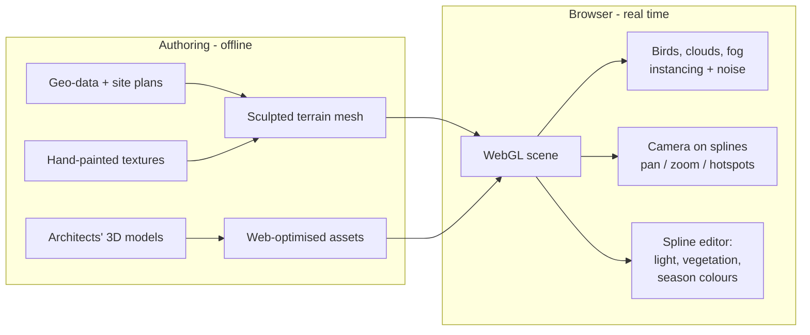
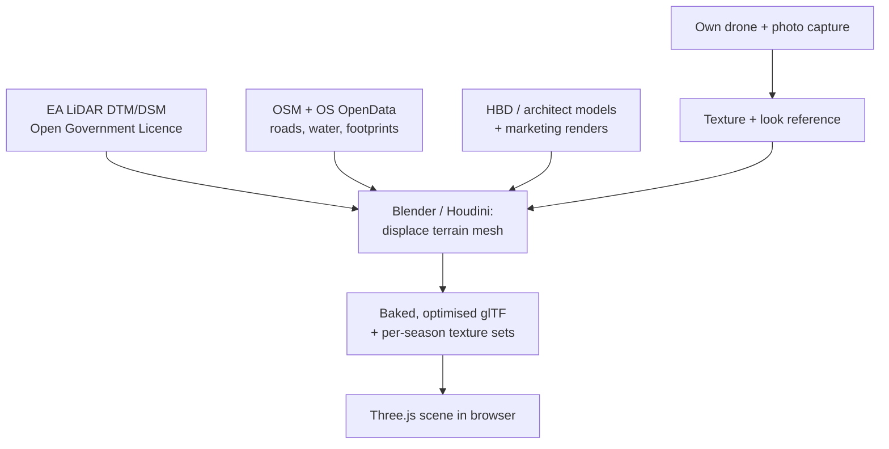
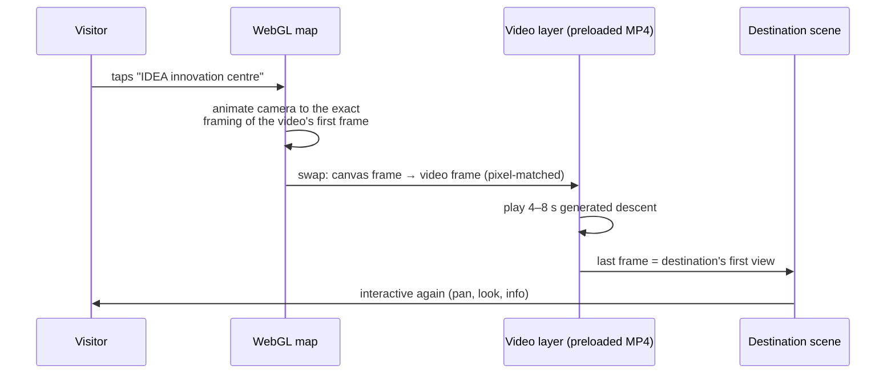
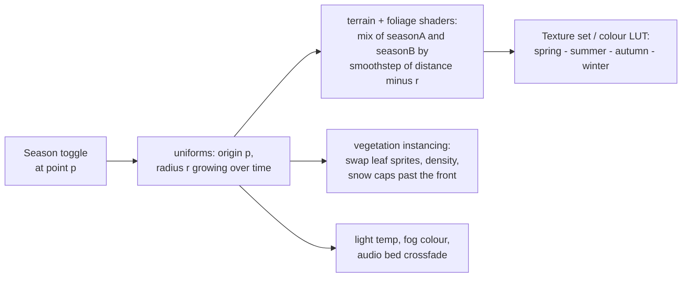
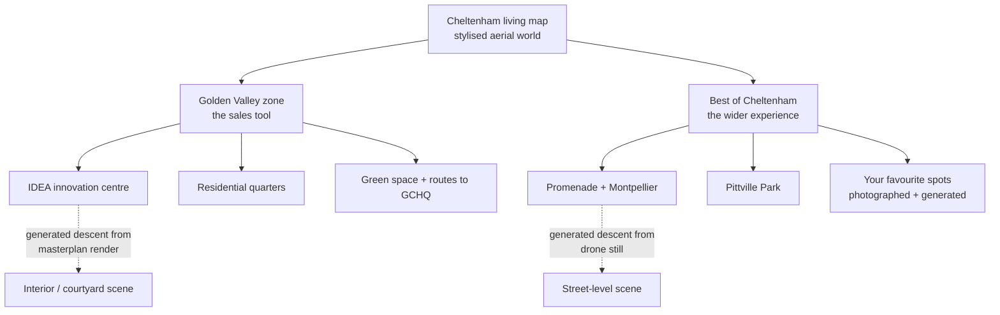
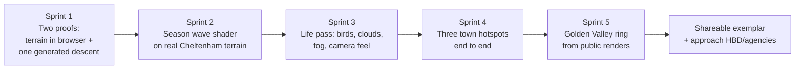

# The living map — maps × generative video

A research map and project plan for an explorable "living map" experience: a stylised aerial world you can pan and zoom, with generated video transitions that fly you down into real places, and a season wave that washes across the landscape transforming plants and colours. First target: the [Golden Valley development](https://www.goldenvalleyuk.com/) in Cheltenham, widening to a "best places in Cheltenham" experience. Exemplar market: large residential and development projects, tourism, architecture and interiors firms.

Inspiration: [Explore Primland](https://explore.ownprimland.com/) ([Awwwards SOTD](https://www.awwwards.com/sites/explore-primland)).

---

## 1. How Primland actually works (and why it matters)

The most important research finding first: **Primland is not Google Earth.** Outpost ([case study](https://outpost.design/work/primland-explore/)) built a hand-crafted digital replica of the 12,000-acre estate:

- **Terrain** modelled from geo-data, reference images and early site plans, textured by artists — which is why it looks painterly rather than photogrammetric.
- **Buildings** came from the architects' (Hart Howerton) original 3D models, optimised for the web.
- **Rendering** is real-time WebGL (Three.js-class stack) with GSAP for animation; Blender for asset authoring.
- **The life** — birds, drifting clouds, fog — are cheap procedural effects: instanced low-poly geometry on spline paths, scrolling noise textures, particle sprites. The feeling of motion costs almost nothing.
- **Seasons already exist there**: their internal WYSIWYG spline editor controls lighting, cloud dynamics, vegetation density and *seasonal colour shifts* without code changes. So the season idea is proven; our twist is the *wave-front reveal* and generative content behind it.
- Hotspots open modal environments (Saloon, Pool & Fitness, Residences) — separately authored scenes, not continuous zoom.

**Why this matters:** the magic is a real-time 3D scene with full artistic control, not streamed satellite imagery. That control is exactly what makes the season wave and the video transitions possible.

---

## 2. The base map: three routes and their licensing reality

This is where "combine Google Earth with video generation" meets a hard wall, so it goes early.

| Route | What it is | Licence for a commercial project | Feed into gen-AI? |
|---|---|---|---|
| **A. Google Earth Studio** | Render cinematic flyover videos from Google Earth | **No.** Earth Studio content may not be used for promotional or commercial purposes ([FAQ](https://www.google.com/earth/studio/faq/)) — selling a development counts | No |
| **B. Google Photorealistic 3D Tiles** | Stream Google's photogrammetry mesh live into your own WebGL app via the [Map Tiles API](https://developers.google.com/maps/documentation/tile/3d-tiles) | **Yes**, paid API, attribution required; renderable in CesiumJS, deck.gl, or Three.js via NASA's 3DTilesRenderer | **No** — [policies](https://developers.google.com/maps/documentation/tile/policies) prohibit caching, pre-rendering, machine interpretation and geodata extraction, so tiles can't be screenshotted into a video-model pipeline |
| **C. Own stylised world** (the Primland route) | Terrain from open UK LiDAR + own textures; buildings from the developer's models | **Yes** — you own it outright | **Yes** — it's your imagery, plus the client's renders, your drone footage and photos |

Route C is unlocked in the UK by genuinely good open data: the Environment Agency's **National LiDAR Programme** (1 m, and 25 cm in places, DSM/DTM under the Open Government Licence) covers Cheltenham, and **OS OpenData / OpenStreetMap** give road, water and building footprints. Terrain accuracy is free; only the artistry costs time.

**Recommendation — hybrid:** build the hero world (Golden Valley site + Cheltenham centre) as an owned stylised scene (Route C), exactly like Primland but seeded from LiDAR rather than sculpted from scratch. Optionally use Route B live tiles as a wide "context zoom-out" layer where nothing is cached or generated from it. Route A is off the table for this use.

---

## 3. Feature 1 — the generated zoom-in transition

The trick that makes this feel beyond Primland: when you select a hotspot, instead of a camera cut you get a *continuous filmed descent* from map altitude into the real place.

**Mechanism: first-frame/last-frame video generation, pre-rendered offline.** Current models (Veo 3.1 "frames to video", Kling, Runway Gen-4.5, Luma) accept a start image and an end image and synthesise the motion between them — depth-aware, so a zoom reads as flight rather than a crossfade. This cannot run in real time (generation takes tens of seconds to minutes and costs per clip), and doesn't need to: hotspots are finite, so every transition is generated once in production, reviewed, and shipped as an ordinary MP4/WebM.

**The seam is the craft.** Frame A is rendered *from our own WebGL scene* at a known camera pose, so the video's first frame can be matched pixel-for-pixel before the swap; frame B is the client's architectural render, our drone still, or a ground photograph. Both endpoints are owned imagery, so the licensing from §2 stays clean.

**Production pipeline per hotspot:**

1. Render frame A from the map scene (exact camera pose stored as JSON).
2. Choose frame B (render / drone still / photo, colour-graded to the map's palette).
3. Generate 3–5 candidates via API (Veo 3.1 via Gemini API; fal.ai aggregates Kling/Luma/others behind one API — the repo's `ai-connectors` pattern applies).
4. Review, pick, upscale/interpolate to 60 fps if needed, encode WebM + HEVC, preload in the app.
5. A reverse clip (or the same clip scrubbed backwards) covers the zoom-out.

**Fallback:** where generation misbehaves (models can hallucinate architecture — a real risk for an unbuilt development where accuracy is contractual), fall back to a classic pre-rendered Blender camera move through the actual model. Same delivery mechanism, zero hallucination. Generated and rendered transitions can coexist per-hotspot.

---

## 4. Feature 2 — the season wave

An expanding ring (or directional front) sweeps outward from the point of interaction; everything it crosses transforms — foliage colour and density, light temperature, snow, bird behaviour.

**Mechanism: a shader, not a video.** Because the world is our own real-time scene (§2 route C), every material can blend between per-season states, driven by one number: distance from the wave origin versus time.

- Terrain and canopy: two texture sets (or one base + per-season colour LUTs) blended by `smoothstep(dist(worldPos, p) - r)`. A little noise on the front makes it feel organic rather than geometric — the "wave" reads as wind moving through the trees.
- Instanced vegetation: past the front, instances swap sprite/atlas index and tint; deciduous trees can drop density in winter.
- Generative AI's role here is in *authoring*, not runtime: image-editing models (Gemini image editing, Flux) restyle the base texture atlases and the hotspot ground-level stills into four consistent seasons far faster than hand-painting, and first/last-frame video (§3) can even generate season-morph clips for the ground-level scenes.

This is the cheapest-to-run, highest-wow feature: one uniform drives the whole world, works on mobile, and every hotspot's generated content gets four seasonal variants for the price of image edits.

---

## 5. Golden Valley × Cheltenham — content plan

Golden Valley gives the project a real client shape: HBD with Cheltenham Borough Council, a £1bn cyber/tech campus 100 m from GCHQ, 1M+ sq ft commercial, 1,000+ homes, 60 %+ public green space, first phase under construction (July 2026). It already owns the three asset types the pipeline needs: aerial renders, architectural visualisations and a masterplan map.

Two-ring structure: the **Golden Valley ring** is the commercial exemplar (their renders become transition endpoints; unbuilt phases shown via render-based descents; seasons demonstrate the landscape investment). The **town ring** is the portfolio piece and tourism exemplar — real places, your photography, personal curation. One world, two stories, and the town ring de-risks the client ring: you can build it without anyone's permission.

Content per hotspot: one map-camera pose, one destination image, one generated (or rendered) descent clip ×2 directions, four season variants of the destination still, ~80 words of copy, optional ambient audio.

---

## 6. Cloud or local?

**Short answer: this project is cloud-native; local is optional polish.** Everything on the critical path runs in the cloud, including these sessions.

| Task | Cloud (here) | Local (your M5 Pro) |
|---|---|---|
| WebGL/Three.js app dev, shaders, season wave | ✅ full dev + headless Chromium screenshots | nice for live GPU iteration |
| Video generation (Veo/Kling/Runway via API) | ✅ these are *only* cloud APIs | n/a |
| Season restyling of textures/stills (image APIs) | ✅ | ComfyUI possible, not needed |
| LiDAR → terrain processing (GDAL, displacement) | ✅ scriptable | ✅ either |
| Terrain texturing, asset optimisation in Blender | ✅ headless/scripted Blender | ✅ better for artistic sculpt/paint |
| TouchDesigner studies (birds/cloud motion tests) | ❌ | ✅ local only |
| Drone/photo capture of Cheltenham | ❌ | ✅ physical world required |
| Hosting (static site + MP4s + optional tile proxy) | ✅ any static host/CDN | n/a |

The finished artefact is a static site plus video files — no server-side compute at runtime beyond a CDN (and a keyed proxy only if the live Google-tiles context layer is used). The only genuinely local pieces are TouchDesigner experiments, hands-on Blender artistry, and pointing a camera at Cheltenham. So: prototype and pipeline in the cloud from day one; pull the world into local Blender when it needs an artist's hand.

---

## 7. Roadmap

- **Sprint 1 (de-risk the two scary parts):** (a) EA LiDAR tile of Cheltenham displaced into a navigable Three.js terrain; (b) one first/last-frame generated descent between two owned images, played seamlessly over a canvas. Everything else is known-possible.
- **Sprint 2:** the season wave on that terrain with AI-restyled texture sets.
- **Sprint 3:** the Primland feeling — instanced birds on splines, noise-driven clouds, fog, eased camera.
- **Sprint 4:** three real hotspots (e.g. Promenade, Pittville, one favourite) with full descent + seasons + copy.
- **Sprint 5:** Golden Valley ring using publicly available renders as a speculative pitch piece.

Sprint 1 is specified as [experiment 002](../experiments/002-living-map/brief.md).

### Risks worth naming

1. **Licensing** is the sharpest edge: no Earth Studio, no caching or AI-processing of Google tiles — solved by the owned-world route (§2).
2. **Model hallucination of architecture** on an unbuilt, contractually-rendered development — solved by the Blender-rendered fallback per hotspot (§3).
3. **Performance on mobile** for a lush instanced world — Primland proves it's doable; budget polygons from day one.
4. **The seam** between live canvas and video is where the illusion lives or dies — Sprint 1 tests exactly this.

---

## Sources

- [Explore Primland — Awwwards SOTD](https://www.awwwards.com/sites/explore-primland) · [Outpost case study](https://outpost.design/work/primland-explore/)
- [Google Photorealistic 3D Tiles docs](https://developers.google.com/maps/documentation/tile/3d-tiles) · [Map Tiles API policies](https://developers.google.com/maps/documentation/tile/policies) · [renderer guidance](https://developers.google.com/maps/documentation/tile/use-renderer)
- [Cesium × Google Maps Platform](https://cesium.com/blog/2023/05/10/cesium-partners-with-google-maps-platform/) · [Photorealistic 3D Tiles in Cesium ion](https://cesium.com/blog/2023/10/26/photorealistic-3d-tiles-in-cesium-ion/)
- [Google Earth Studio FAQ (commercial-use restrictions)](https://www.google.com/earth/studio/faq/) · [community clarification](https://support.google.com/earth/thread/350390104/clarification-on-non-commercial-use-of-google-earth-studio-content?hl=en)
- [Veo 3.1 frames-to-video guide](https://www.veo3ai.io/blog/veo-3-1-frames-to-video-guide-2026) · [AI video generators compared 2026](https://rangy.ai/blog/ai-video-generators-compared-2026/) · [first/last-frame control overview](https://prompt-architects.com/blog/371-first-frame-and-last-frame-control)
- [Golden Valley UK](https://www.goldenvalleyuk.com/)
