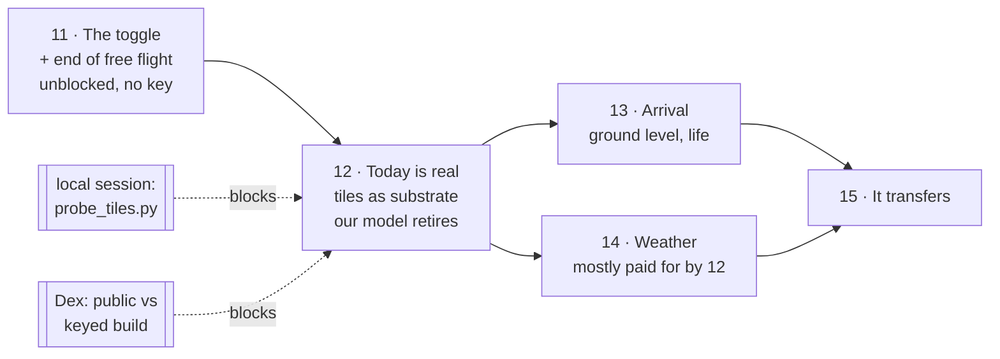

# From map to piece

11 Sep 2026. Three notes from Dex, and they are the same note three times:

> No slider — that was a design decision, it's meant to be a **toggle**.
> Utilise the new Google API content, it's much more realistic.
> **It's still a 3d map that we can move around — I don't really want this.**

Phases 7–10 made the map *better*: smaller, faster, public, and able to say
what it is. None of them questioned that it should be a map. This one does.

---

## 1. What we built against what we said we wanted

Three references, and we are measured against all three.

### A. Primland — the original inspiration

The research finding in [the living map plan](living-map-plan.md) §1 was
"Primland is not Google Earth". The part we acted on was *hand-built world*.
The part we did not act on is the more important half: **Primland is directed.**
You do not fly it. You are moved through it. Hotspots open authored scenes.
The interaction budget for the whole experience is: look, choose, arrive.

Every frame a Primland visitor sees is a frame somebody composed. That is not
a rendering achievement, it is a **refusal** — the refusal to hand over the
camera.

### B. The client's own language — `official/aerial-03.jpg`

Their hero image is a photomontage: a real aerial photograph of west Cheltenham,
GCHQ unmistakable, with the development composited in. We noted this on 9 Sep
and drew the right conclusion about the *pipeline* — real measured place as
substrate, authored buildings painted on — and then built a stylised model of
the substrate anyway, because at the time that was the only substrate available.

That changed on 10 Sep. Google's photogrammetry lands GCHQ's ring within a few
pixels of our surveyed lock. **The substrate is now available.**

### C. Our own vision frames

`vision/frame1-aerial.png` and `frame5-arrival.png` were generated in Sprint 1
as the target. They are photographic: sun through a canopy, people at scale,
wildflower in the foreground, weather on the horizon. We have been building
towards them with extrusions and a green blanket.

### The gaps, named

| | what the references do | what we do | the gap |
|---|---|---|---|
| **Camera** | composed shots, moved between | orbit, pan, dolly, free | we built a viewer, not a view |
| **Today** | a photograph of the real place | our model of the real place | we are hand-making a worse copy of something free |
| **Distance** | 400 m *and* 1.6 m | 300–700 m, always | no arrival, so no reason to be anywhere |
| **Change** | before / after, same frame | a continuum you can park in the middle of | a half-built field is neither a place nor a proposal |
| **Light** | haze, cumulus, long shadow, depth | one sun, flat sky, hard green | reads as a planning diagram |

---

## 2. The one sentence the piece is aiming at

> **A place you are shown, which answers one question — *what will this be?* —
> by putting the answer in the same frame as what is there now.**

Not a map. A held frame with a switch in it. Everything below is in service of
that sentence, and anything that is not gets cut.

```
   today                                      2045
   ┌──────────────────────────┐   toggle   ┌──────────────────────────┐
   │  Google photogrammetry   │  ◀──────▶  │  the same photograph,    │
   │  the real town, lit by   │            │  with our scheme         │
   │  the day it was flown    │            │  standing on it          │
   └──────────────────────────┘            └──────────────────────────┘
              same camera, same second, nothing else moves
```

That is the client's own montage, except it switches — and they cannot do that
with a JPEG. It is the whole product in one control.

---

## 3. The interaction model, before and after

```
  NOW                                    AFTER
  ┌─────────────────────────────┐        ┌─────────────────────────────┐
  │ OrbitControls               │        │ 5–7 named viewpoints        │
  │  drag: pan                  │        │  composed, locked, good     │
  │  right-drag: orbit          │   ->   │                             │
  │  scroll: zoom               │        │ move BETWEEN them on an     │
  │  → every frame is one the   │        │ eased arc, never steered    │
  │    visitor composed, badly  │        │ → every frame is one WE     │
  │                             │        │   composed                  │
  │ year slider 2026 ⟷ 2045     │        │ TODAY ⟷ 2045, one toggle   │
  │  + play + readout + band    │        │  the wave is the transition,│
  │  → 19 resting states, 17 of │        │  never a resting state      │
  │    which are mush           │        │ → 2 resting states, both    │
  │                             │        │   of them arguments         │
  └─────────────────────────────┘        └─────────────────────────────┘
```

**Free look does not disappear — it stops being the default.** In a room
somebody will ask "can we see it from the north", and the answer should be yes.
So it becomes a secondary affordance on a held shot, damped, with limits, that
snaps back. The difference between a tool you can reach for and a tool you are
handed on arrival is the entire difference between a viewer and a piece.

---

## 4. The phases

### Phase 11 — The toggle, and the end of free flight

*Unblocked, needs no key, do it now.*

1. **The slider dies.** `TODAY ⟷ 2045` as one control. The shader keeps its
   continuous front — `setWave` is unchanged, `?wave=` still works for
   captures — but the *interface* only ever offers the two ends, and the sweep
   between them is the transition, about 1.4 s, eased at both ends.
2. **The scheme band stops being a progress bar** and becomes what it always
   wanted to be: the case, stated once, at 2045. It fills on the way there and
   then holds.
3. **Viewpoints replace orbit.** Five to seven named, composed cameras. A
   visitor moves between them; the camera travels on an eased arc it owns.
   Orbit is retained, damped and limited, behind a deliberate gesture.
4. **Chrome to the floor.** Attribution, the toggle, where you are. Everything
   else earns its place or goes.

**Done when:** someone who has never seen it cannot produce an ugly frame.

### Phase 12 — "Today" stops being ours

*Blocked on two measured numbers from the local session.*

1. The probe runs (`scripts/probe_tiles.py`), `MELT_METRES` and
   `GROUND_OFFSET_METRES` stop being placeholders, and the spread gets quoted.
2. **Tiles become the default today wherever a key exists.** Not a layer you
   switch on — the substrate.
3. **Our today-geometry retires.** Existing buildings, existing trees and land
   cover have exactly one job left: they are the 2045 scheme, and the keyless
   fallback. Everything our model was doing to imitate the real town is now
   done better by a photograph. This is a **subtraction phase** — payload goes
   down, not up.
4. The 2045 scheme learns to stand in a photograph's light rather than our own:
   matching the tiles' exposure and shadow direction is a measurement, not an
   art problem, and it is what makes the montage read as one image.

**Done when:** the toggle at the aerial viewpoint reads as the same photograph
twice — once as flown, once as proposed.

**Settled, 11 Sep.** Tiles need a key and a key on a public URL is a public
bill, so: the **public URL stays ours** — measured map, no key, no billing, no
terms to honour — and a **keyed build** behind a referrer-restricted key is
what goes in front of a client. Two builds, one codebase; `build_site.py`
already does exactly this split for the Meshy models.

### Phase 13 — Arrival

*The descent mechanism is proven and idle.*

Sprint 1 answered "can a generated video descent play so seamlessly that the
seam disappears" with yes, and the piece currently uses it to reach five
**photographs**. `vision/frame5-arrival.png` is what arrival should be: you are
standing somewhere, at 1.6 m, among people, in the afternoon.

Two or three viewpoints get a ground-level destination: composed approach,
generated descent, and a destination frame with life in it. The rest keep the
held aerial, which is honest — not every viewpoint has a there to get to.

**Done when:** frame 5's feeling exists at one hotspot, and you can come back up.

### Phase 14 — Weather

Most of this phase gets **paid for by phase 12**: a photograph brings its own
light, its own haze and its own horizon, so the sky, the grade and the far
field stop being ours to invent. What remains is narrow and worth doing —
cloud shadow moving across a held frame, a little depth of field at the long
end, and the horizon behind the tiles' own edge.

Deliberately after 12, because every one of these changes invalidates the
approved plates, and doing that once beats doing it twice.

### Phase 15 — It transfers

Unchanged from [phases 7–10](golden-valley-next-phases.md): a second bounding
box, end to end, with the time written down. A second site is what turns an
exemplar into a service.

---

## 5. The order, and what blocks what



Phase 11 goes first because it is the only one nothing is waiting on, and
because the interaction model decides which shots phase 12 has to make real.
Composing the viewpoints first means the tiles arrive into frames that already
know what they are for.

## 6. What gets cut

Naming these so they stop costing thought:

- **The scrubbable year.** Nineteen states, seventeen of them mush. Two states,
  both arguments.
- **Our model of today.** Once the tiles land it is a worse copy of a free
  photograph, and keeping it "for comparison" is the sunk-cost version of a
  feature.
- **Far-field terrain.** Already parked; phase 12 kills it outright, because
  the tiles bring the far field with them.
- **Blur zooms.** Ruled out 10 Sep, still out.
- **Any frame the visitor composed.** That is the whole of phase 11.


---

## Phase 11 — result, 11 Sep 2026

Done: the switch, the shots, the fence, the chrome.

**Five shots, chosen by looking.** Sixteen candidates over two rounds, every
one rendered at both ends of the switch and tiled into a contact sheet, because
the pair is the product and a shot that is beautiful at 2045 and empty at 2026
has failed. Two rules did the cutting:

- **The edge of the box must never appear.** It killed every shot that looked
  north-west, because the terrain runs out 270 m behind the new homes. Turning
  that one round to look *back* at the town fixed the frame and improved the
  argument — new quarter in the near field, the Cheltenham it joins on the
  skyline.
- **There must be horizon in it.** It killed the overlay camera, the one
  matched against the developer's own hero in September: at 16:9 it is a plan
  view with no sky, however well the ground lines up.

**The brook is not a shot.** It was tried four ways — across, along, close,
high — and the wetland corridor never reads from the air at any distance. It is
a thing you stand next to, so it belongs to an arrival. Fifteen point eight
hectares of the scheme's best argument, deferred to phase 13 rather than shown
badly now.

| shot | what it is for |
|---|---|
| The vale | where this is: whole town, the ring in the middle, escarpment behind |
| Cyber Central | nine hectares of campus, the brook, and the hundred metres to the Doughnut |
| The meadow roof | the one frame where what is *already here* becomes the argument |
| The homes | a new quarter against an edge that already exists |
| Panels and glasshouses | the half of the scheme that is landscape rather than architecture |

**The fence.** Measured on the running page: distance locked to the shot's own
(561 m at the panels, unchanged after eight scroll-wheel events), pan and zoom
off, 34° of swing and 16° of tilt. You can look round the frame; you cannot
leave it, and every move resets the lean so a shot cannot be permanently
spoiled.

**What the frames caught that no test would have.** The first pass shipped four
faults that only looking finds: the dots were hidden *behind* the switch panel,
the copy washed out over pale sky, the chevrons were invisible over sunlit
grass at half opacity, and the licence line ran under the panel and lost a line
and a half. All four are chrome-against-photograph problems, and all four are
fixed — a bottom deck so nothing has to guess how tall anything else is, and
the credit stopping where the deck starts. The card took three goes: a local
pool of shade behind the words kept having to deepen until it read as a smudge
on a photograph, and the answer in the end was the device the design already
had at the bottom edge — a shallow scrim across the top of the whole frame,
which seats the card on every shot and gives the still the top weight it was
missing.

**And one the shots exposed that had been hiding for weeks.** Four of the
eight markers in this map stand on the *same ground*: `gchq`, `gchq-meadow`
and `cyber-central` are three photographs of the Doughnut, and the `doughnut`
descent is a fourth way into it, all anchored at (123, 64). Declutter has been
silently discarding three of them since the markers landed — it keeps the
nearest and drops the rest, which looked like tidiness and was actually loss.
Naming two of them on one shot does not offer a choice, it offers a coin toss:
the meadow roof listed the descent, declutter kept the photograph, and the
descent could not be reached at all. So the rule is now **one route per ground
point, per shot**, `test_viewpoints.py` fails if any shot offers two markers
within 60 m of each other, and `gchq` and `cyber-central` are deliberately
unattached — a today photograph of ground the switch already shows you, and a
wide 2045 view of the ring the vale already frames.

**And one the tests did catch.** `syncCameraOwner` asked whether anything was
`busy`, which is false while you are *standing* in a photograph — so the shots
took the camera back the instant a descent landed and pulled the view 721 m off
the plate it had just arrived at. Ownership means having it, not moving.

Suites: `test_viewpoints.py` 14/14 (new), `test_year_switch.py` 20/20,
`test_places.py` 19/19, `test_hotspot_flow.py` rewritten — the three descents
are no longer all on screen at once, so it now chooses the view and then the
place in it, which is the flow.


---

## Phase 11 — merged, 12 Sep 2026

`aa622a5` on `main`, and the public URL now opens on the five shots with the
switch under them.

**Merging it took the site down, and nothing went red.** Worth writing down,
because the fault was a year older than the change that exposed it. Pages was
still set to *Deploy from a branch*, so every push to `main` started **two**
deployments: this project's workflow, which publishes what `build_site.py`
assembles into `dist/`, and GitHub's own `pages build and deployment`, which
Jekyll-builds the repository **root** and has never heard of `dist/`. Whichever
finishes last wins.

```
  10 Sep   ours 20:41:12   ·   theirs 20:41:04     ours won by 8 s   -> the map
  12 Sep   ours 08:16:46   ·   theirs 08:17:14   theirs won by 28 s  -> 404
```

So the map had been live on a coin toss since the day it was published, and the
first toss simply went our way. Both runs report success either way, which is
why it was invisible.

Restored by re-running the workflow so ours landed last. Two things follow:

1. **The setting, which only Dex can change:** Settings → Pages → Build and
   deployment → Source: **GitHub Actions**. That retires the branch build and
   leaves one deployer.
2. **A guard, in case it is ever turned back:** the deploy job now waits past
   the window a competing deployment lands in and asks the live URL whether the
   map is actually there, failing the run — loudly, naming the Jekyll takeover
   — if it is not. A green deploy is not a live map.
