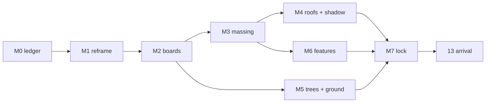

# Phase 12, second half: the 2045 model, made stark

*Decided 15 Sep 2026. Phase: Define, moving into Develop.*

The map is the product, and the switch between today and 2045 is the whole
argument. Today the switch barely changes anything. This plan makes it stark
in the three places Dex named: **buildings, trees and sustainable features**.

Numbered M0 to M7 so the piece's phases 13 (arrival), 14 (weather) and 15
(transfers) keep their numbers. Arrival is built on the model this produces.

---

## Where we are, measured

Keyed live map, 14 Sep, branch head `0deec2d`. "Changes strongly" is the share
of ground in frame (sky excluded) whose 8 px blocks differ by more than 30 of
255 between today and 2045.

| Shot | Camera to look point | Changes strongly |
|---|---|---|
| The vale | 1,166 m | 2% |
| The meadow roof | 785 m | 3% |
| Cyber Central | 627 m | 6% |
| Panels and glasshouses | 524 m | 11% |
| The homes | 700 m | 21% |

| Surface | Now | Scheme / references |
|---|---|---|
| Homes | 70 gabled boxes on 15 ha | 1,000+ low-carbon homes (goldenvalleyuk.com), about 1,100 in the SPD |
| Campus | 20 blocks of 38 × 17 m, about 58,000 m² | 1M+ sq ft (about 93,000 m²); named buildings IDEA, ROUTER, INPUT, OUTPUT |
| Roofs | one flat tint per family | meadow roofs (IDEA's runs to the ground), PV, planted terraces |
| Trees | 6,234 of one shape, reads as stipple, 0.51 stops flat | veteran oaks, woodland courtyards, avenues, orchards |
| Agrivoltaics | painted into the ground texture | panel rows with height, shadow and glint |
| Glasshouses | 3 pale boxes | glass volumes |
| Water | a colour class | SuDS ponds and wetland edges that reflect sky |
| Shadow | 2045 casts none onto the photograph | everything new casts onto the tiles |

---

## Decisions (Dex, 15 Sep)

1. **Shots at 250 to 450 m** to the look point. Today stays Google's
   photograph (above the melt line: tiles off below 140 m focus, back on at
   165 m). The meadow roof's closeness comes from a narrower lens, not from
   moving inside the melt line.
2. **Density is scheme-true**: about 1,100 homes and 93,000 m²+ of campus in
   the box. The boards decide character, not count. The press figure of 3,700
   homes is the wider West Cheltenham allocation and is not ours.
3. **GCHQ's car parks get solar canopies.** The cars stay; the roofs change.
4. **Three board variants per frame plus one kit sheet**, about 16 images,
   all free Codex.

---

## The references we already hold, and what each is for

Two kinds of existing imagery feed this plan.

**Theirs: the scheme's live site, HBD and Grimshaw.** These are held in
`inspiration/golden-valley/` under its README: third-party copyright,
private reference, never shipped, and **not sent to any generator without
Dex's yes** (Codex image generation sends its inputs off this machine). The
default use is that we look, then write down words and numbers. The boards
then get those words and numbers, not their pixels.

**Ours: approved renders and photographs.** We can use these freely.

| Reference | What we take from it | Phase |
|---|---|---|
| `official/aerial-03.jpg` (live site: photomontage over a real aerial) | Where the masses sit relative to GCHQ, the A40 and the field grain. Render our 2045 from the overlay camera in its README and compare massing, internal only. | M0, M3, M7 |
| `grimshaw/…n26…` (masterplan aerial over the real landscape) | Residential parcels, green corridors, the edge against the fields | M0, M3 |
| `official/aerial.jpg` = `hbd/Aerial-5` (IDEA) | The signature: a meadow roof that runs to the ground, PV on the flat roofs, sett paths cutting through meadow. Our NCIC model is this building. | M2 kit, M4 |
| `hbd/Arrival-1`, `hbd/GV_02` (OUTPUT, 7 levels), `GV_03` | Pale stone with vertical fins, planted terraces, glazed ground floor. This settles the "facade stone reads warm" fault: sample it, don't guess. | M3, M4 |
| `official/courtyard.jpg` = `hbd/Courtyard-2` | Woodland courtyard planting under a retained veteran oak; dark banded brick as the counterpoint material | M5 |
| `grimshaw/…n39, n43, n41` (streets) | Residential typology: sawtooth-roof terraces, 3 to 4 storey balconied blocks, mews. Sawtooth roofs are a silhouette that reads from the air. | M3, M4 |
| `grimshaw/…n38` (wetland) | Homes backing onto SuDS and wet meadow, reed margins | M5, M6 |
| `grimshaw/…n34` (park) | Blocks around a wildflower park; roof planting | M3, M5 |
| `official/cheltenham-hills-photo.jpg` (real photograph) | Haze, horizon and the Severn Vale, the ground truth for how far things read | M1, M7 |
| goldenvalleyuk.com text | Programme and phasing: IDEA and ROUTER (2028, ROUTER two storeys), INPUT and OUTPUT (2029, OUTPUT 7 levels), residential 2029 to 2033, a second transport hub, a Future Industry Quarter by 2035, IDEA targeting 5.5-star NABERS. 2045 is every phase complete. | M0, M3, place copy |
| Our five place photographs (`generate/*/out/*-photo`) | Approved look: the meadow roof is the standard for every board. They were generated from plates of the *old* model, so M3 moves ground under them; M7 re-plates or retires each one. | M2, M7 |
| Our `vision/frame1…5` | Light and life targets; frame 5 belongs to arrival | M2, 13 |
| Our `generate/close-2045/facade-study.png`, `campus-ncic`, `gchq-meadow` plates | The close-range starting renders for the kit sheet | M2 |
| Storyboard pairs (`board-graded/`) | The baseline every M step is measured against | all |

Cut from the references: `hbd/GV_04` (an interior, not seen from the air) and
the parked Meshy GLBs.

---

## The phases

Codex writes code and prompts in worktrees; the main session runs, measures and
merges; Dex approves the boards and the frames. Nothing spends money.

### M0: the contrast ledger *(Define, half a day)*

- For each shot, name three visible changes: one building, one tree and one
  sustainable feature.
- Pin the programme from the live site and the SPD, and name the four campus
  buildings in the model.
- Read the layout off `aerial-03` and Grimshaw's `n26`: where the campus,
  residential parcels and corridors sit.
- Baseline the contrast numbers (above) and a stranger test: shown a pair for
  5 s, can someone name three differences?

**Done when** Dex signs a one-page ledger: five shots, three moves each, and a
floor of 35% "changes strongly" per shot.

### M1: reframe the shots *(Develop, 1 day)*

- Every shot at 250 to 450 m, with a narrower lens, each about one pillar:
  - homes streets
  - campus courtyards around IDEA
  - the meadow roof and GCHQ's solar car parks
  - panels and glasshouses
  - the orchard and wetland edge
- Candidate pairs come from `compose_viewpoints.py`.
- `test_places.py` and `test_tiles_frame.py` stay green. Horizon in every
  frame, no box edge.

**Done when** Dex picks five frames from a pair sheet.

### M2: target boards *(Develop, 1 to 2 days)*

- For each frame, render our own model keyless (never Google tiles) and pass it
  to Codex. The references are the meadow roof photograph plus a written spec
  from the table above. Three variants per frame.
- A kit sheet of six close studies:
  - IDEA's meadow roof
  - an OUTPUT-type finned block
  - a sawtooth terrace street
  - an agrivoltaic row
  - a SuDS or wetland edge
  - the tree palette
- Reject any board that invents a layout we can't model: boards sit on our
  streets.
- From each approved board, write a spec file: counts, roof mix %, sampled
  colours, tree forms and heights.

**Done when** each frame has one approved board plus its spec, and the kit
sheet is approved.

### M3: density and massing *(Develop, 2 to 3 days)*

- Extend `scripts/golden_valley_2045.py` to about 1,100 homes on the 22° grid.
  Mix sawtooth terraces, mews and 3 to 4 storey balconied blocks, with gardens
  and street trees in the plan.
- Campus as perimeter courtyard blocks to 93,000 m²+. IDEA, ROUTER (two
  storeys), INPUT and OUTPUT (seven levels) are named buildings. Add a local
  centre, a school and the second transport hub.
- Build it as rules, not hand placement, so phase 15's second site inherits
  it. Instanced throughout.
- Internal check: our 2045 rendered from the `aerial-03` overlay camera, masses
  in the same relationships.

**Done when** counts are within 10% of the programme, each frame sits beside
its board, and the budget holds: +1.5 MB gz or less, 60 fps on a laptop, 30 on
a phone.

### M4: roofs and shadow *(Develop, 2 days)*

- A roof programme from the board specs:
  - meadow roofs (the GCHQ shader, generalised; IDEA's runs to the ground)
  - PV with a sun glint
  - planted terraces
  - sawtooth silhouettes
  - solar canopies over GCHQ's car parks
- Facade stone is sampled from `Arrival-1` / `GV_02` into `KEYED_GRADE`.
- 2045 buildings and trees cast shadows onto the photograph, with the sun from
  `MEASURED_SUN`.

**Done when** `probe_light.py` still passes (buildings within ±0.5 stops of
photographed buildings), shadows fall the same way as the photograph's, and
the roof mix matches the boards.

### M5: trees and ground *(Develop, 2 days)*

- Four or five canopy forms at 2045 maturity, including retained veteran oaks.
- Woodland courtyards and clumped belts, street avenues, orchard rows.
- Hedges get volume, land-cover edges go soft, and wet meadow gets water that
  reflects the sky environment.

**Done when** the canopy probe closes the 0.51-stop gap and trees read as
volume in the stranger test.

### M6: sustainable features as objects *(Develop, 2 days)*

- Agrivoltaic rows as instanced geometry, glasshouses as glass volumes, SuDS
  ponds and swales, ROUTER's cycle greenway.
- Only what reads from the chosen frames; the rest goes to arrival.

**Done when** every ledger feature is visible in its frame, and its place copy
carries a scheme number.

### M7: lock and hand to arrival *(Deliver, 1 day)*

- Re-run the contrast numbers, the stranger test, the probes and a real-phone
  check.
- Re-plate or retire each of the five place photographs where M3 moved the
  ground under them.
- Dex signs off the five pairs. Phase 13's close plates are rendered from this
  model.

**Done when** every shot is at or above 35%, all tests are green, and it's
pushed.

---

## Cut

- Facade detail past 250 m: the bay grid is enough; roofs and shadow carry it.
- Bespoke buildings beyond GCHQ and the four named campus buildings; no Meshy
  revival.
- People and cars in the aerials; they belong to arrival.
- The brook as an aerial subject; water shows only as sky reflection.
- New aerial photographs as deliverables; boards are references only.
- Any feature the ledger doesn't name.

Sources: goldenvalleyuk.com (masterplan, IDEA, INPUT, OUTPUT, ROUTER,
RESIDENTIAL pages, read 15 Sep 2026); Cheltenham Borough Council, Golden
Valley SPD; `inspiration/golden-valley/README.md`.
