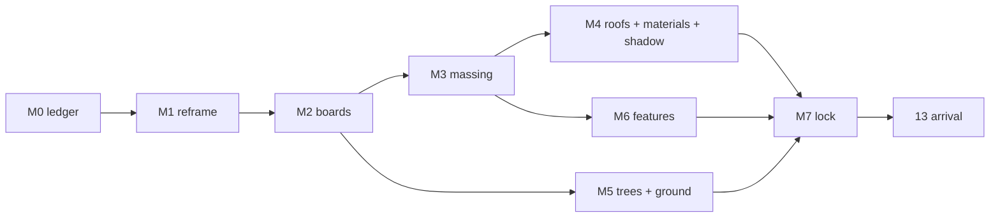

# Phase 12, second half: the 2045 model, made stark

*Decided 15 Sep 2026; design direction set 21 Sep. Phase: Define, moving into Develop.*

The map is the product, and the switch between today and 2045 is the whole
argument. Today the switch barely changes anything. This plan makes it stark
in the three places Dex named: **buildings, trees and sustainable features**.

Numbered M0 to M7 so the piece's phases 13 (arrival), 14 (weather) and 15
(transfers) keep their numbers. Arrival is built on the model this produces.

---

## Where we are, measured

Keyed live map, 14 Sep, branch head `0deec2d`. "Changes strongly" is the share
of ground in frame (sky excluded) whose 8 px blocks differ by more than 30 of
255 between today and 2045.

| Shot | Camera to look point | Changes strongly |
|---|---|---|
| The vale | 1,166 m | 2% |
| The meadow roof | 785 m | 3% |
| Cyber Central | 627 m | 6% |
| Panels and glasshouses | 524 m | 11% |
| The homes | 700 m | 21% |

| Surface | Now | Scheme |
|---|---|---|
| Homes | 70 gabled boxes on 15 ha | 1,000+ low-carbon homes (goldenvalleyuk.com), about 1,100 in the SPD |
| Campus | 20 blocks of 38 × 17 m, about 58,000 m² | 1M+ sq ft (about 93,000 m²); named buildings IDEA, ROUTER, INPUT, OUTPUT |
| Roofs | one flat tint per family | meadow roofs, PV, planted terraces |
| Trees | 6,234 of one shape, reads as stipple, 0.51 stops flat | veteran oaks, woodland courtyards, avenues, orchards |
| Agrivoltaics | painted into the ground texture | panel rows with height, shadow and glint |
| Glasshouses | 3 pale boxes | glass volumes |
| Water | a colour class | SuDS channels, ponds and wetland edges that reflect sky |
| Shadow | 2045 casts none onto the photograph | everything new casts onto the tiles |

---

## Decisions (Dex)

1. **Shots at 250 to 450 m** to the look point (15 Sep). Today stays Google's
   photograph, above the melt line (tiles off below 140 m focus, back on at
   165 m). The meadow roof's closeness comes from a narrower lens.
2. **Programme is scheme-true** (15 Sep): about 1,100 homes and 93,000 m²+ of
   campus in the box; IDEA, ROUTER, INPUT and OUTPUT as named buildings. The
   press figure of 3,700 homes is the wider West Cheltenham allocation.
3. **GCHQ's car parks get solar canopies** (15 Sep). The cars stay; the roofs
   change.
4. **Three board variants per frame plus one kit sheet** (15 Sep), about 16
   images, all free Codex.
5. **The scheme's renders may go into the generator** (21 Sep). The project
   is non-commercial and private, so the images from goldenvalleyuk.com and
   HBD are cleared as Codex references. Still never shipped.
6. **Not Grimshaw's style, and more adventurous than the scheme** (21 Sep).
   The scheme's architects are corporate. Our 2045 aims at design excellence
   and realism. The scheme gives us *what and where*: counts, siting, named
   buildings. The architecture, the landscape and the energy are ours, set by
   the direction below.
7. **Adventurous, on every shot** (22 Sep). Dex picked the adventurous
   board for all five frames (`generate/m2/boards/*-adventurous.png`). They
   are the targets the live model is worked towards and measured against;
   specs in `generate/m2/specs/`.

---

## Design direction: excellence and realism

**Two tests for every board and every model change.**

- **Realism.** It must look built and photographed, not rendered. Every move
  below has a built precedent. There are no fantasy towers, no forests on
  balconies, and nothing that only works in a CGI.
- **Excellence.** It must hold up next to the best built work of its type
  in the UK and northern Europe, and not read as an office park.

The dial from measured to adventurous is decided by picking boards: each
frame gets one **measured**, one **bold** and one **adventurous** variant.

| Pillar | The move | Built precedents (named in prompts, not copied) |
|---|---|---|
| Homes | Dense, low-rise and high-quality: Passivhaus terraces with steep roofs, cohousing around shared gardens, 4 to 6 storey mass-timber apartment blocks. Whole roofs of PV on the terraces, meadow on the flat roofs. From the air: rhythm, pitch and texture. | Goldsmith Street, Norwich (Mikhail Riches, Stirling Prize 2019); Marmalade Lane, Cambridge; Solarsiedlung, Freiburg (Rolf Disch) |
| Campus | Mass timber and glass around courtyards, with **one landmark that does something**: IDEA's walkable meadow roof running to the ground. Roofs are the facade from the air: PV sawn to the sun, planted terraces. | Sara Kulturhus, Skellefteå (White Arkitekter); Powerhouse Brattørkaia, Trondheim (Snøhetta); IDEA's meadow roof from the scheme |
| Water | Open stormwater channels and rain gardens along streets, feeding ponds and the wet meadow. They read from the air as silver lines that reflect the sky. | Augustenborg, Malmö; Tåsinge Plads, Copenhagen |
| Energy | Vertical bifacial PV rows over grazed pasture: fences of glass that read at 400 m, with the crop visible between. Solar canopies over GCHQ's car parks. Glasshouses on the campus's waste heat. | Next2Sun vertical agrivoltaics (Germany); solar carports; Westland glasshouses (NL) |
| Trees | Native mixes at 2045 maturity: retained veteran oaks, woodland courtyards, street avenues, orchard rows. No monoculture grid. | Accordia, Cambridge (landscape-led density) |

Heights stay believable next to GCHQ: 7 storeys at most (OUTPUT's height in
the scheme), and IDEA is the only landmark.

---

## The references we already hold, and what each is for

**Theirs, from the scheme** (`inspiration/golden-valley/`), cleared for
generator input on 21 Sep. We take **siting and programme** from them, not
their architecture.

| Reference | What we take | Phase |
|---|---|---|
| `official/aerial-03.jpg` (live site: a photomontage over a real aerial) | Where the masses sit relative to GCHQ, the A40 and the field grain. Codex gets it with our render for placement. It also gives a private massing check from the overlay camera in its README. | M0, M2, M3, M7 |
| `official/aerial.jpg` = `hbd/Aerial-5` (IDEA) | The one piece of their architecture we keep: the meadow roof running to the ground. It is the scheme's own landmark and our NCIC model is this building. | M2 kit, M4 |
| `official/courtyard.jpg`, `hbd/Arrival-1`, `hbd/GV_02` | Scale and programme only: OUTPUT at seven levels, courtyard proportions, retained oaks. Their facades are the corporate baseline we are aiming past. | M3 |
| `grimshaw/…n26…` (masterplan aerial) | Parcel layout only: where residential sits and where the corridors run. **Not its style.** | M0, M3 |
| `official/cheltenham-hills-photo.jpg` (a real photograph) | Haze, horizon, Severn Vale: how far things actually read | M1, M7 |
| goldenvalleyuk.com text | Programme and phasing: IDEA and ROUTER (2028, ROUTER two storeys), INPUT and OUTPUT (2029, OUTPUT 7 levels), residential 2029 to 2033, a second transport hub, a Future Industry Quarter by 2035. 2045 is every phase complete. | M0, M3, place copy |

**Ours**, free to use.

| Reference | What we take | Phase |
|---|---|---|
| The five place photographs (`generate/*/out/*-photo`) | The approved look. The meadow roof is the standard for light, planting and realism. They came from plates of the *old* model; M7 re-plates or retires each one. | M2, M7 |
| `vision/frame1…5` | Light and life; frame 5 belongs to arrival | M2, 13 |
| `generate/close-2045/` plates (facade study, campus-ncic, gchq-meadow) | Starting renders for the kit sheet | M2 |
| Storyboard pairs (`board-graded/`) | The baseline every M step is measured against | all |

Not used: the Grimshaw street, park and wetland illustrations (style
excluded), `hbd/GV_04` (an interior), and the parked Meshy GLBs.

---

## The phases

Codex writes code and prompts in worktrees; the main session runs, measures and
merges; Dex approves the boards and the frames. Nothing spends money.

### M0: the contrast ledger *(Define, half a day)*

- For each shot, name three visible changes: one building, one tree and one
  sustainable feature. Draw them from the design direction.
- Pin the programme from the live site and the SPD, and name the four campus
  buildings.
- Read the layout off `aerial-03` and `n26`: the campus, the residential
  parcels and the corridors.
- Baseline the contrast numbers (above) and a stranger test: shown a pair for
  5 s, can someone name three differences?

**Done when** Dex signs a one-page ledger: five shots, three moves each, and a
floor of 35% "changes strongly" per shot.

**Draft ledger (22 Sep, for sign-off).** Shot ids are fixed when M1's frames
are picked.

| Shot | Building | Trees | Sustainable |
|---|---|---|---|
| Homes streets | Passivhaus terrace streets and timber blocks where there were fields | Street avenues; a woodland belt on the farmland edge | Whole-roof PV; stormwater channels along the streets into a pond |
| Campus around IDEA | Timber courtyard campus around IDEA's walkable meadow roof; OUTPUT at seven storeys | Woodland courtyards with retained oaks | PV sawn to the sun on the flat roofs; ROUTER and the cycle greenway |
| Meadow roof | GCHQ's ring re-roofed as wildflower meadow | Tree avenues along the car park edges | Solar canopies over every GCHQ car park |
| Panels and glasshouses | Glasshouses on the campus's waste heat | Mature orchard rows; woodland behind | Vertical bifacial PV over grazed pasture |
| Orchard and wetland edge | Terraces backing onto the wet meadow | The orchard ring and woodland copses | Wet meadow with open water reflecting the sky |

### M3a: rough massing, in parallel with M0 to M2 *(added 22 Sep)*

Dex: the 2045 half reads as "a sparse dot of trees in a field". The count and
the siting come from the scheme, not the boards, so they don't wait for M2.
Codex extends `golden_valley_2045.py` now:
- homes and campus cells get internal streets and perimeter blocks, not one
  row of buildings round the edge
- about 1,100 dwellings and 93,000 m²+ of campus, with OUTPUT, INPUT and ROUTER
  named
- mature orchards, woodland belts on the farmland edge, avenues on the new
  streets

The boards later decide character (roofs, materials, typology detail); M3
becomes refinement of this pass rather than a first build.

### M1: reframe the shots *(Develop, 1 day)*

- Every shot at 250 to 450 m, with a narrower lens, each about one pillar:
  - homes streets
  - campus courtyards around IDEA
  - the meadow roof and GCHQ's solar car parks
  - panels and glasshouses
  - the orchard and wetland edge
- Candidate pairs come from `compose_viewpoints.py`.
- `test_places.py` and `test_tiles_frame.py` stay green. Horizon in every
  frame, no box edge.

**Done when** Dex picks five frames from a pair sheet.

### M2: target boards *(Develop, 1 to 2 days)*

- For each frame, a keyless render of our own model (never Google tiles) goes
  to Codex with:
  - the meadow roof photograph, for light and realism
  - the scheme's aerial, for siting
  - a written brief from the design direction, naming its precedents
- Three variants per frame: measured, bold, adventurous.
- A kit sheet of six close studies:
  - IDEA's meadow roof
  - a mass-timber campus block
  - a Passivhaus terrace street with PV roofs
  - vertical agrivoltaics over pasture
  - a stormwater street and pond
  - the tree palette
- Reject any board that invents a layout we can't model, or that fails either
  test.
- From each approved board, write a spec file: counts, roof mix %, sampled
  colours, materials, tree forms and heights.

**Done when** each frame has one approved board plus its spec, and the kit
sheet is approved.

### M3: density and massing *(Develop, 2 to 3 days)*

- Extend `scripts/golden_valley_2045.py` to about 1,100 homes on the 22° grid:
  - steep-roofed Passivhaus terraces
  - cohousing courts
  - 4 to 6 storey timber blocks
  - gardens and street trees in the plan
- Campus as timber courtyard blocks to 93,000 m²+. IDEA, ROUTER (two storeys),
  INPUT and OUTPUT (seven levels) are named buildings. Add a local centre, a
  school and the second transport hub.
- Build it as rules, not hand placement, so phase 15's second site inherits
  it. Instanced throughout.
- Internal check: our 2045 rendered from the `aerial-03` overlay camera, masses
  in the same relationships.

**Done when** counts are within 10% of the programme, each frame sits beside
its board, and the budget holds: +1.5 MB gz or less, 60 fps on a laptop, 30 on
a phone.

### M4: roofs, materials and shadow *(Develop, 2 days)*

- A roof programme from the board specs:
  - PV roofs on the terraces
  - meadow on the flat roofs (the GCHQ shader generalised; IDEA's runs to the
    ground)
  - PV sawn to the sun on the campus
  - planted terraces
  - solar canopies over GCHQ's car parks
- A material palette from the approved boards: brick, timber and glass,
  sampled into `KEYED_GRADE`. This replaces the warm authored stone.
- 2045 buildings and trees cast shadows onto the photograph, with the sun from
  `MEASURED_SUN`.

**Done when** `probe_light.py` still passes (buildings within ±0.5 stops of
photographed buildings), shadows fall the same way as the photograph's, and
the roof mix matches the boards.

### M5: trees and ground *(Develop, 2 days)*

- Four or five native canopy forms at 2045 maturity, including retained
  veteran oaks.
- Woodland courtyards and clumped belts, street avenues, orchard rows.
- Hedges get volume, land-cover edges go soft, and the wet meadow and
  stormwater channels get water that reflects the sky environment.

**Done when** the canopy probe closes the 0.51-stop gap and trees read as
volume in the stranger test.

### M6: sustainable features as objects *(Develop, 2 days)*

- Vertical agrivoltaic rows as instanced geometry, glasshouses as glass
  volumes, stormwater channels and ponds, ROUTER's cycle greenway.
- Only what reads from the chosen frames; the rest goes to arrival.

**Done when** every ledger feature is visible in its frame, and its place copy
carries a scheme number.

### M7: lock and hand to arrival *(Deliver, 1 day)*

- Re-run the contrast numbers, the stranger test, the probes and a real-phone
  check.
- Re-plate or retire each of the five place photographs where M3 moved the
  ground under them.
- Dex signs off the five pairs. Phase 13's close plates are rendered from this
  model.

**Done when** every shot is at or above 35%, all tests are green, and it's
pushed.

---

## Cut

- Grimshaw's illustration style and typologies, and office-park facades.
- Facade detail past 250 m: the bay grid is enough; roofs and shadow carry it.
- Bespoke buildings beyond GCHQ and the four named campus buildings; no Meshy
  revival.
- People and cars in the aerials; they belong to arrival.
- The brook as an aerial subject; water shows only as sky reflection.
- New aerial photographs as deliverables; boards are references only.
- Any feature the ledger doesn't name.

Sources: goldenvalleyuk.com (masterplan, IDEA, INPUT, OUTPUT, ROUTER,
RESIDENTIAL pages, read 15 Sep 2026); Cheltenham Borough Council, Golden
Valley SPD; `inspiration/golden-valley/README.md`.

## M4-lite, what changed

- Normalised every 2045 footprint winding before meshing, closed the gables,
  and added 400 mm eaves, 750 mm flat-roof parapets and dark plinths.
- Gave each terrace dwelling its own facade bay, window rhythm, roof panel
  grid and party break, with 45 degree roofs and measured south-east PV faces.
- Reworked apartments as silvered-larch mass timber, campus blocks as timber
  and glass with meadow and PV roofs, and glasshouses as framed glass volumes.
- Initially generated 110 open solar canopies over 1.16 ha of classified GCHQ
  car parks; the follow-up below replaces that first-pass layout.
- Kept one 4096 px soft shadow map and made loaded Google tile materials receive
  the shadows from 2045 buildings, canopies and trees.
- Kept 1,030 dwellings and 105,501 m2 of campus floor area unchanged. The
  generated building payload is 19 KB gzipped, including the new canopies.
- Follow-up: excluded both present-day building datasets, GCHQ's courtyard and
  surveyed tree crowns before fitting canopies, then asserted every roof and
  post remains at least 3 m from today's building footprints.
- Found 5.92 ha of mapped parking within 400 m (5.08 ha usable after those
  exclusions) and now covers all 35 usable car-park components with 180 crisp
  paired/single PV rows: 2.78 ha of roof and 2.45 ha of parking directly shaded.
- Stored the terrain height at every canopy post, so posts run from `groundAt`
  ground to the tilted canopy underside instead of sharing a low corner base.
- Reworked the Doughnut roof as graded wildflower meadow: 5-20 m planting
  patches, yellow/white/purple fleck, two concentric mown paths, radial cuts
  and a darker planted edge, all derived from `KEYED_GRADE.meadow`.
- Masked photographed masts and lighting columns above the Doughnut's surveyed
  roof footprint while its 2045 meadow is visible, leaving today's tiles intact.
